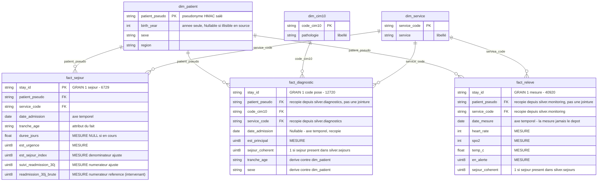
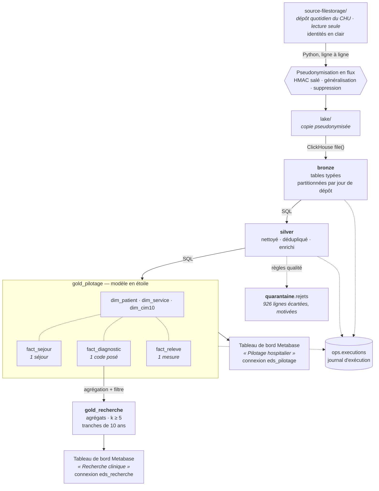

# Entrepôt de Données de Santé — CHU

**Rapport de conception** · Module Big Data M2 · Épreuve E05

---

## 1. Le besoin métier

Le CHU dispose de données éparpillées entre quatre systèmes — dossier patient,
urgences, laboratoire, monitoring des chambres — exportées chaque jour dans des
formats hétérogènes (CSV, JSON imbriqué, Parquet). Personne ne peut aujourd'hui
répondre à une question transverse sans consolider ces exports à la main.

Deux publics, aux besoins opposés :

|                            | Attend                                     | Granularité requise           |
| -------------------------- | ------------------------------------------ | ----------------------------- |
| **Direction hospitalière** | Piloter l'activité et la qualité des soins | Fine, par service et par jour |
| **Recherche clinique**     | Décrire des cohortes de patients           | Agrégée, jamais individuelle  |

Six indicateurs sont nommés : durée moyenne de séjour par service, passages
aux urgences par jour, taux de réadmission à 30 jours, relevés de constantes en
alerte, prévalence par pathologie, distribution par âge et sexe. Le § 4 du
sujet ajoute une septième ligne, ouverte — « toute autre vue d'activité pertinente » — que
quatre vues complémentaires remplissent : occupation, mortalité, case-mix,
origine géographique.

Les six se calculent depuis la couche gold, et `tests.verifier indicateurs` les
restitue à chaque exécution — la valeur obtenue **et** la propriété qui la
fonde. Un chiffre qui s'affiche ne prouve rien par lui-même : ce qui le rend
opposable, c'est que son dénominateur, son périmètre et ses seuils soient
vérifiés en même temps que lui. Les valeurs constatées sur le dépôt courant
figurent au § 2.10.

**Chaque public reçoit désormais ses indicateurs par un tableau de bord
Metabase qui lui est propre** — « Pilotage hospitalier » pour la direction,
« Recherche clinique » pour la recherche — provisionné par `eds.restitution`
(§ 1 du sujet). Aucun réglage de l'outil de restitution n'intervient dans le
cloisonnement : chaque tableau de bord interroge la couche gold à travers le
compte ClickHouse borné de son usage, et c'est ce compte, pas Metabase, qui
prononce le refus si une carte tentait d'atteindre l'autre base. Le choix de
l'outil et la façon dont il s'articule au cloisonnement sont détaillés au
§ 2.11.

### 1.1 Les sources fournies

Le CHU dépose chaque jour ses exports dans un espace en **lecture seule**
(`source-filestorage/`), dans trois formats différents. Vingt-huit jours de
dépôt sont disponibles, du 1er au 28 août 2026.

| Source | Format | Dépôts | Volume brut | Ce qu'elle porte |
| --- | --- | --- | --- | --- |
| `patients` | CSV | 3 jours | 18 000 lignes → **6 000 patients** | `patient_id`, `nir`, `nom`, `prenom`, `birth_date`, `sex`, `region_code` — **l'identité réelle** |
| `sejours` | CSV | 28 jours | **6 797 séjours** | `stay_id`, `patient_id`, `service_code`, admission et sortie, modes d'entrée et de sortie |
| `diagnostics` | JSON imbriqué | 28 jours | 6 797 objets → **12 720 codes** | un à trois codes CIM-10 par séjour, typés `principal` ou `associe` |
| `monitoring` | Parquet | 28 jours | **41 778 relevés** | constantes au chevet — fréquence cardiaque, saturation, température. La source volumineuse |
| `referentiels` | CSV | 1er jour | 8 services · 13 codes CIM-10 | nomenclatures : code → libellé |

Quatre traits de ces sources ont déterminé l'architecture, et aucun n'est
annoncé par le cahier des charges — ils ont été découverts en les profilant
(§ 2.1). Le détail chiffré de ce profilage, anomalie par anomalie, est dans
[`exploration/RAPPORT-EXPLORATION.md`](../exploration/RAPPORT-EXPLORATION.md).

**La complétude n'est pas uniforme.** Le monitoring ne couvre que **12,8 %
des séjours**, et seulement deux services sur huit en sont équipés. Ce n'est
pas une anomalie à corriger mais un périmètre à énoncer partout où
l'indicateur de constantes est diffusé.

**La contrainte qui structure tout le projet** : il s'agit de données de santé,
catégorie particulière au sens de l'article 9 du RGPD. Les fichiers sources
contiennent l'identité réelle des patients — nom, prénom, numéro de sécurité
sociale, date de naissance complète. La conformité n'est donc pas une couche
ajoutée en fin de chaîne : c'est une contrainte de conception présente à chaque
étape, et elle explique la majorité des choix ci-dessous.

---

## 2. Les choix et leur justification

### 2.1 Une exploration avant toute décision

Cinq sources ont été profilées avant d'écrire la moindre ligne de pipeline. Ce
travail a produit quatre constats qui ont directement déterminé l'architecture,
et qu'aucune lecture du cahier des charges ne laissait deviner.

**`patients` est un snapshot cumulatif, les trois autres sources sont des
deltas.** Chaque fichier journalier de patients contient toute la population
connue à date : 18 000 lignes pour 6 000 patients réels. Les séjours,
diagnostics et relevés n'apparaissent au contraire qu'une fois. Appliquer la
même stratégie d'ingestion aux quatre sources aurait multiplié par 3 tout
indicateur rapporté au patient.

**Les sources n'ont pas le même calendrier de dépôt.** Séjours, diagnostics et
relevés sont déposés les 28 jours du mois ; le snapshot `patients` ne l'est que
les trois derniers. La population de référence est donc l'**union** des dépôts,
et non celui du jour : un séjour du 1er août n'est décrit que par un fichier
arrivé 25 jours plus tard. Une lecture jour à jour prendrait ce décalage pour
une rupture d'intégrité référentielle.

**Le monitoring déborde de son jour de dépôt.** Le fichier du 1er août contient
des relevés jusqu'au 3, et le décalage se reproduit sur les 28 dépôts. Agréger
sur le jour de dépôt attribuerait au 1er des alertes survenues deux jours plus
tard : l'agrégation se fait donc sur l'horodatage de la mesure.

**Les valeurs aberrantes du monitoring sont une panne de capteur, pas du bruit.**
Fréquence cardiaque et saturation sont *toujours* invalides ensemble — 858 fois
les deux, jamais l'une seule — sur exactement quatre combinaisons de butée :
(0 ou 500 bpm) × (0 ou 120 %). Le relevé entier est écarté : un capteur
déconnecté ne garantit la fiabilité d'aucune de ses mesures.

### 2.2 La pseudonymisation, au plus tôt possible

Le cahier des charges demande de pseudonymiser « à l'entrée du lake » tout en
décrivant par ailleurs le lake comme une « copie brute ». Ces deux exigences
sont incompatibles. **Nous avons tranché en faveur de la minimisation RGPD** :
le lake contient une copie fidèle mais pseudonymisée.

La transformation s'applique **au fil de la copie, ligne par ligne**. Les
identités ne sont donc écrites nulle part — pas même dans un répertoire
temporaire — et l'empreinte mémoire ne dépend pas de la taille des fichiers.

| Donnée source          | Traitement                          | Justification                                                                                                                              |
| ---------------------- | ----------------------------------- | ------------------------------------------------------------------------------------------------------------------------------------------ |
| `patient_id` (IPP)     | HMAC-SHA256 salé, tronqué à 64 bits | Déterministe pour préserver les jointures, salé parce que l'espace des IPP est énumérable — un SHA-256 nu serait cassable par dictionnaire |
| `nir`, `nom`, `prenom` | Supprimés                           | Directement identifiants, sans usage pour les indicateurs demandés                                                                         |
| `birth_date`           | Généralisée à l'année               | Aucun indicateur ne requiert la date exacte                                                                                                |

Un contrôle automatisé rejoue les **17 384 valeurs identifiantes** de la source
contre l'intégralité du lake et échoue si l'une d'elles y apparaît. Il vérifie
également l'absence de collision de pseudonyme et la préservation des jointures.

### 2.3 Un cloisonnement physique, pas conventionnel

Le sujet définit **deux publics** et ce que chacun doit voir : au pilotage la
durée de séjour, l'activité des urgences, la réadmission et la surveillance des
constantes ; à la recherche la prévalence par pathologie et la description de
cohorte. Il en tire une contrainte explicite — « pilotage et recherche ne voient
pas les mêmes données → droits d'accès distincts ».

Un filtre applicatif serait contournable par quiconque écrit sa propre requête.
Nous avons donc séparé **physiquement** : deux bases ClickHouse, deux comptes de
lecture, des droits disjoints.

**Quatre comptes ClickHouse**, aux vocations distinctes :

| Compte             | Vocation                                                                             | Ce qu'il peut atteindre                                            |
| ------------------ | ------------------------------------------------------------------------------------ | ------------------------------------------------------------------ |
| `eds_admin`        | Exécuter le pipeline — créer les tables, appliquer les habilitations                 | Tout. C'est le compte du traitement, pas un compte d'usage         |
| `eds_pilotage`     | Direction hospitalière — piloter l'activité et la qualité des soins                  | 17 colonnes de `gold_pilotage`. Rien d'autre                       |
| `eds_recherche`    | Recherche clinique — décrire des cohortes, sous contrainte de petits effectifs       | Les deux tables d'agrégats de `gold_recherche`. Rien d'autre       |
| `eds_exploitation` | Investigation technique — incident, piste d'audit, demande d'effacement              | `bronze`, `silver`, `quarantaine`, `ops` — en **lecture seule**    |

**Le compte d'investigation n'est pas une commodité technique.** Dans un
entrepôt de données de santé, quelqu'un doit pouvoir **remonter à la ligne
d'origine** — pour diagnostiquer un incident, produire une piste d'audit, ou
exécuter une demande d'effacement au titre du RGPD. C'est précisément ce que les
colonnes `_fichier_source` et `_run_id` rendent possible. Ni le pilotage ni la
recherche n'atteignent ce détail, fût-il pseudonymisé : eux n'ont accès qu'à
gold, et seulement à leur base.

Ce compte mérite d'être justifié. L'administration aurait pu investiguer avec le
compte du pipeline, qui a tous les droits. Nous ne l'avons pas fait :
`eds_admin` peut créer et supprimer des bases, et ce pouvoir n'a pas sa place
dans un usage quotidien, où une requête maladroite suffirait. Le compte
d'exploitation applique le moindre privilège — il lit tout ce qui est nécessaire
à une investigation, et le moteur lui refuse toute écriture.

**Les droits sont posés colonne par colonne, pas base par base.** C'est la
conséquence directe du choix d'un modèle en étoile : la couche gold contenant les
faits au grain de l'événement, un `GRANT` sur la base entière donnerait au
pilotage l'accès à `patient_pseudo` et à `stay_id`. Or la direction consulte des
indicateurs d'activité — elle n'a jamais à désigner un patient ni à relier deux
séjours.

`eds_pilotage` ne dispose donc que des **17 colonnes** que ses indicateurs
utilisent : codes de service, dates, tranches d'âge, durées et drapeaux
d'alerte. Ni le pseudonyme, ni l'identifiant de séjour, ni les horodatages
précis, ni les constantes brutes ; `dim_patient` et `fact_diagnostic` ne lui sont
pas accordées du tout. Vérifié : il ne peut ni lire le pseudonyme, ni dénombrer
des patients, ni exécuter un `SELECT *` — et il calcule sans difficulté la DMS,
les passages aux urgences et les relevés en alerte.

**Cette borne ne dépend pas de qui interroge, mais du compte employé.**
Quiconque se connecte avec `eds_pilotage` — administrateur compris — se voit
opposer le même refus, prononcé par le moteur. C'est ce qui distingue un
cloisonnement d'un réglage d'interface : l'outil de restitution branché sur ces
bases — Metabase, § 2.11 — hérite de la borne sans pouvoir la contourner, quels
que soient ses propres réglages. Ce n'est plus une intention : chaque public
**reçoit désormais ses indicateurs par un tableau de bord Metabase dédié**, et
la borne que l'interface applique est celle du compte ClickHouse qu'elle
emploie, jamais un paramètre posé dans Metabase lui-même.

Ce choix conduit à faire des indicateurs des **tables matérialisées et non des
vues**. Une vue ordinaire s'exécute en ClickHouse avec les droits de l'appelant :
une vue gold obligerait à ouvrir aussi l'accès à silver, et le cloisonnement
s'effondrerait. Le moteur sait, depuis la version 24.4, déclarer une vue
`SQL SECURITY DEFINER` qui s'exécute avec les droits de son créateur ; cette
alternative a été écartée pour une autre raison — un indicateur recalculé à
chaque lecture n'est pas un instantané, et c'est l'instantané qui rend possible
le contrôle de `tests.verifier indicateurs`, qui confronte chaque table au fait
dont elle sort.

### 2.4 Le risque de ré-identification, mesuré puis corrigé

La généralisation à l'année demandée par le sujet **ne suffit pas**. Mesure du
k-anonymat sur les quasi-identifiants restants :

| Granularité de l'âge  | Population à k ≥ 5 | Patients uniques | Cohortes sous le seuil |
| --------------------- | ------------------ | ---------------- | ---------------------- |
| Année de naissance    | 62,3 %             | **185**          | 95                     |
| **Tranche de 10 ans** | **100 %**          | **0**            | **13**                 |

D'où la règle retenue : l'année n'existe qu'en pilotage, accès restreint ; la
base recherche n'expose que des tranches de dix ans. Le filtre des petits
effectifs (`>= 5 patients`) est appliqué **à l'écriture**, de sorte qu'aucune
donnée sous le seuil n'existe dans cette base — il n'y a rien à penser à masquer
au moment de la lecture.

**La généralisation seule ne suffit pas, et les données le montrent.** Les
tranches de dix ans ramènent toute la population à k ≥ 5, mais **treize cohortes
restent sous le seuil** : la nomenclature comporte trois pathologies rares —
mucoviscidose, amyotrophie spinale, trisomie 21 — dont les effectifs sont faibles
quelle que soit la granularité de l'âge. C'est le filtre à l'écriture, et lui
seul, qui garantit la propriété.

**Ce filtre se déclenche donc sur les données réelles.** Deux prévalences sont
supprimées à la construction — trisomie 21 (3 patients) et mucoviscidose (4) —
ainsi que treize cohortes de description : elles existent au grain du fait en
pilotage, elles n'atteignent pas `gold_recherche`. `tests.demontrer effectifs`
va plus loin et fabrique le cas limite que les données ne fournissent pas — une
pathologie portée par exactement 4 patients, une autre par exactement 5 —
reconstruit silver et gold, et constate où tombe la coupe : la première est
retenue, la seconde passe. Le seuil coupe bien *sous* 5, et non *à* 5, comme le
demande le §5.

### 2.5 Un modèle en étoile, **et** un catalogue de KPI

Le § 6 décrit gold comme des « indicateurs par usage » — une table par
indicateur. C'est le chemin de lecture le plus direct, et il correspond au
besoin courant : la direction consulte une DMS, elle ne compose pas une
requête. Mais pris seul, ce raccourci a un défaut rédhibitoire : **il fige les
questions**. Croiser la durée de séjour par service *et* par tranche d'âge, ou
la ventiler par pathologie, exige d'avoir anticipé la combinaison exacte et
d'ajouter une table.

Nous avons donc fait les deux, dans cet ordre de dérivation :

| Niveau | Contenu | Pour qui |
| --- | --- | --- |
| **Indicateurs agrégés** | 8 tables `kpi_*` : DMS, urgences, réadmission, alertes, occupation, mortalité, case-mix, origine géographique | La lecture courante — un indicateur, une table, aucune jointure |
| **Modèle en étoile** | 3 faits, 3 dimensions conformes | L'analyse qu'aucune table figée ne couvre |

Les huit tables d'indicateurs sont **dérivées des faits**, jamais de silver.
Un indicateur et le fait dont il sort doivent donner le même chiffre par
construction — et `tests.verifier indicateurs` confronte chaque table à son
recalcul depuis les faits, en cardinalité comme en valeur. Sans ce contrôle,
une table d'agrégat continuerait de servir un chiffre que plus rien ne fonde.

Chaque table porte son **effectif** à côté de sa mesure. Un taux sans son
dénominateur ne s'interprète pas : 23,5 % d'alertes sur 34 relevés et 7,5 %
sur 252 ne pèsent pas de la même façon — c'est exactement le cas qui se
présente au dernier jour de la série, quand le dépôt s'amenuise.

**L'étoile, sous les indicateurs** : trois tables de faits, à trois grains
distincts, partageant des dimensions conformes.

| Fait              | Grain                         | Volume |
| ----------------- | ----------------------------- | ------ |
| `fact_sejour`     | un séjour                     | 6 729  |
| `fact_diagnostic` | un code posé lors d'un séjour | 12 720 |
| `fact_releve`     | une mesure au chevet          | 40 920 |

Dimensions : `dim_patient`, `dim_service`, `dim_cim10`.



**Pourquoi trois faits et non un seul.** Les grains sont incompatibles : un
séjour porte 1 à 3 diagnostics et 0 à n relevés. Les fusionner en une table
unique multiplierait les lignes et fausserait toute somme — c'est le *fan trap*
classique. Une DMS calculée sur une table jointe aux relevés compterait chaque
séjour autant de fois qu'il a de mesures.

**Deux dénormalisations assumées.** `fact_diagnostic` porte le pseudonyme
patient, son âge et son sexe, recopiés depuis le séjour : les questions de
recherche portent sur des cohortes de patients par pathologie, et cette copie
leur évite deux jointures systématiques. De même, le drapeau de réadmission est
calculé **une fois** dans `fact_sejour` plutôt que laissé à l'outil de
restitution : c'est une auto-jointure, hors de portée d'une requête d'analyse
ordinaire.

**Les faits se construisent sur les dimensions.** Les trois dimensions sont
écrites en premier ; les faits ensuite, et tout attribut de dimension dont un
fait a besoin est lu **dans la dimension**, jamais re-dérivé depuis silver.
C'est ce qui fait de l'étoile un modèle plutôt que trois tables qui se
ressemblent, et c'est ce qui rend l'intégrité vérifiable : sept contrôles
`fait → dimension` s'exécutent à chaque passage de `tests.verifier qualite`.

Le choix a une conséquence pratique : `fact_diagnostic` lit le sexe dans
`dim_patient` et non dans `silver.patients`. L'attribut n'a qu'une source de
vérité, et le jour où la dimension évolue — historisation, correction — les
faits suivent sans qu'on ait à y penser.

**Nuance à énoncer : `fact_diagnostic` et `fact_releve` ne rejoignent plus
`silver.sejours`, ni `dim_service`, pour leurs attributs porteurs.** Depuis la
décision de l'intervenant sur la cohérence temporelle (§ 2.8), un diagnostic ou
un relevé n'a plus besoin d'un `INNER JOIN silver.sejours` pour connaître son
patient, son service et son admission : `silver.diagnostics` et
`silver.monitoring` les portent déjà, enrichis **en silver**, contre
`bronze.sejours`. Gold les recopie donc tels quels — `patient_pseudo`,
`service_code`, `admission_ts` — sans les relire dans une dimension ni les
rejoindre à `silver.sejours`. Le seul appariement de dimension qui subsiste au
grain de l'événement est le `LEFT JOIN dim_patient` de `fact_diagnostic`, pour
`age_au_sejour` et `sexe` ; `fact_releve` ne porte ni l'un ni l'autre et
n'est joint à aucune dimension.

**L'âge est un attribut du fait, dérivé contre la dimension.** `dim_patient` ne
porte pas d'âge : celui-ci dépend de la date de l'événement. Mais il ne se
calcule pas non plus en silver, où on l'aurait figé trop tôt : `age_au_sejour`
croise `dim_patient.birth_year` et l'axe `date_admission` du fait, au moment où
le fait est construit. C'est la définition même d'un attribut dérivé de fait —
ni une propriété de la personne, ni une donnée de la source.

La jointure est un `LEFT JOIN` volontaire. Un séjour dont le patient serait
absent de la dimension doit rester dans le fait avec un âge `NULL`, jamais
disparaître : c'est la même règle que partout ailleurs ici — on écarte
explicitement, on ne perd pas silencieusement.

**Ce que compte une cohorte : tous les types de diagnostic, le principal en
complément.** Chaque séjour porte un diagnostic principal et 0 à 2 associés —
6 797 principaux (un par séjour, y compris les 68 aux dates incohérentes,
cf. § 2.8) contre 5 923 associés. `coh_prevalence.nb_patients` — la colonne de
**référence**, celle qui porte désormais le filtre des petits effectifs — compte
les patients distincts portant un code CIM-10 donné, **quel que soit son type** :
motif d'hospitalisation ou comorbidité. C'est la définition retenue par
l'intervenant, et c'est elle qui détermine ce qui est diffusé. Sur
l'insuffisance cardiaque (I50), par exemple : 729 patients hospitalisés *pour*
ce motif, **2 156** si l'on compte aussi ceux qui la portent en comorbidité —
près du triple, et c'est ce second chiffre qui est publié au § 2.10.

`coh_prevalence.nb_patients_principal` reste exposée à côté, en complément :
c'est l'**ancienne** définition de ce projet, restreinte au motif
d'hospitalisation seul, toujours pertinente pour qui veut la prévalence au
sens strict — mais elle ne détermine plus la diffusion.

**La description de cohorte, elle, garde le grain du diagnostic principal.**
`coh_description` (âge × sexe) continue de filtrer `est_principal = 1` :
croiser âge et sexe a un sens univoque sur le motif d'hospitalisation, moins
sur une liste de comorbidités où un même patient apparaîtrait potentiellement
dans plusieurs cellules d'une même pathologie.

Ce choix n'est pas neutre sur le chiffre obtenu : il doit donc accompagner
l'indicateur partout où celui-ci est diffusé, et pas seulement figurer ici. Un
indicateur dont on ne dit pas ce qu'il compte n'est pas exploitable — c'est le
« justifier chaque chiffre » du § 4 du sujet. Le détail par type de diagnostic reste
disponible en pilotage, où `fact_diagnostic` porte `est_principal`.

**Le prix de ce choix.** Les faits sont au grain de l'événement et portent le
pseudonyme patient. Ils ne peuvent donc pas être exposés à la recherche, qui
pourrait y reconstituer des cohortes sous le seuil. Ils vivent dans
`gold_pilotage`, dont l'accès est restreint ; la recherche reçoit des agrégats
dérivés de ces mêmes faits. C'est un arbitrage entre liberté d'analyse et
exposition, tranché différemment selon le public.

### 2.6 Le traitement s'exécute dans le moteur

Le lake est monté en lecture seule dans ClickHouse, qui lit lui-même les
fichiers CSV, JSON et Parquet via `file()`. **Python n'envoie que du SQL** :
aucune donnée ne transite par sa mémoire. C'est l'inverse de l'anti-pattern qui
consiste à extraire les données pour les transformer avec pandas.

### 2.7 Incrémental en amont, recalcul en aval

Bronze est partitionné par jour de dépôt : rejouer un jour supprime sa partition
et la réécrit, sans toucher aux autres. Silver et gold sont au contraire
**recalculés intégralement** à chaque exécution — 0,12 seconde à ce volume.

Ce choix garantit qu'un rejeu produit exactement le même état, avec un mécanisme
explicable en une phrase. Sa limite est réelle et assumée : il ne tiendrait pas
sur plusieurs années d'historique (voir § 3.3).

### 2.8 Rien n'est perdu silencieusement

**Décision de l'intervenant : la cohérence temporelle d'un séjour n'écarte plus
ses diagnostics ni ses relevés.** Un séjour dont `discharge_ts < admission_ts`
est toujours écarté de `silver.sejours` (règle du §3) — mais cette anomalie
porte sur **deux colonnes de la table `sejours`**, et ne dit rien de la
validité d'un code CIM-10 posé pendant ce séjour, ni d'une mesure prise au
chevet du patient : ce sont des faits médicaux distincts, sur d'autres tables.
Le calquer sur ces deux tables ferait porter à une donnée clinique valide
l'anomalie d'une autre colonne, sur une autre ligne.

En conséquence, `silver.diagnostics` et `silver.monitoring` lisent désormais
`bronze.sejours` directement — jamais `silver.sejours` — pour s'enrichir du
patient, du service et de l'admission porteurs, et ne consultent
`silver.sejours` que pour poser un drapeau `sejour_coherent` (1 si le séjour y
figure), **jamais pour filtrer**. Le diagnostic ou le relevé d'un séjour
incohérent est donc **conservé** en silver, avec `sejour_coherent = 0`, et
recopié tel quel jusqu'en gold (`fact_diagnostic.sejour_coherent`,
`fact_releve.sejour_coherent`) — signalé, jamais silencieusement perdu. Seule
l'**absence de patient identifié** écarte réellement l'un ou l'autre : séjour
introuvable en bronze (motif `sejour_inconnu`) ou pseudonyme vide (motif
`sejour_ecarte`) — cf. le détail des motifs plus bas.

Chaque ligne écartée est écrite dans `quarantaine.rejets` avec son motif. La
propriété en découle et se vérifie en une requête :

```
sejours       6 729 +    68 =  6 797
diagnostics  12 720 +     0 = 12 720
monitoring   40 920 +   858 = 41 778
```

**Le total de la quarantaine monitoring (858) ne porte plus qu'un seul motif,
`capteur_hors_plage`.** Les motifs `sejour_ecarte`, `sejour_inconnu` et
`releve_hors_sejour` valent chacun **0 ligne** sur ce dépôt — ils restent
définis et exercés (`tests.demontrer qualite`), mais aucune donnée réelle ne
les déclenche ici : aucun `stay_id` de monitoring n'est absent de
`bronze.sejours`, aucun `patient_id` n'est vide, et les 520 relevés postérieurs
à une sortie de séjour incohérent échappent au contrôle temporel plutôt que de
l'enfreindre (cf. § 2.9).

**Pour chaque source, silver + quarantaine = bronze, à la ligne près.** C'est ce
qui distingue écarter une donnée de la perdre.

Une ligne fautive n'est pas toujours écartée : elle peut être **corrigée**,
lorsque la valeur inutilisable ne porte aucune clé. La colonne `action` du
registre sépare les deux issues — `'ecarte'` entre dans l'équation, `'corrige'`
est signalée sans être soustraite. Sans cette distinction, corriger une valeur
ferait disparaître une ligne du compte, ou bien la correction resterait
invisible : les deux sont inacceptables dans un registre d'incidents qualité.

**Pourquoi une base à part, et non `silver.rejets`.** Deux raisons, et aucune
n'est esthétique. D'abord le contrat de la couche : silver signifie « nettoyé,
cohérent » ; y loger la table des lignes sales brouille exactement ce que la
couche promet, et un `GRANT SELECT ON silver.*` livrait le registre avec les
données propres. Ensuite le cycle de vie : ces lignes portent `stay_id` et, dans
`detail`, les valeurs brutes fautives — c'est de la donnée de santé
pseudonymisée, mais dont la durée de conservation n'est pas celle de l'entrepôt.
On purge une quarantaine quand l'incident qualité est instruit, pas quand la
donnée expire. Une base distincte permet de lui appliquer sa propre rétention et
ses propres droits — et, le jour venu, de la confier à un référent qualité sans
lui ouvrir silver.

### 2.9 Ce qui change à chaque passage de couche

Le sujet demande de « justifier chaque chiffre ». Voici, frontière par
frontière, ce que subit la donnée — et l'effet chiffré de chaque opération.

#### Source → Lake · pseudonymisation

Seules `patients` et `sejours` sont transformées : ce sont les deux seules
sources portant de l'identité. Les trois autres sont recopiées à l'octet près.

| Opération                       | Effet                                                                                                           |
| ------------------------------- | --------------------------------------------------------------------------------------------------------------- |
| `patient_id` → `patient_pseudo` | HMAC-SHA256 salé, tronqué à 64 bits. Appliqué **aux deux sources** avec le même sel, pour préserver la jointure |
| `birth_date` → `birth_year`     | Généralisation. `1933-12-09` devient `1933`                                                                     |
| `nir`, `nom`, `prenom`          | **Supprimés** — 3 colonnes sur 7 disparaissent de `patients`                                                    |
| Volumétrie                      | **inchangée** : 24 797 lignes entrent, 24 797 sortent                                                           |

#### Lake → Bronze · typage et mise en forme tabulaire

Aucune ligne n'est écartée à ce stade. C'est délibéré : on ne peut compter
que ce qu'on a laissé entrer.

| Opération                      | Effet                                                                                                     |
| ------------------------------ | --------------------------------------------------------------------------------------------------------- |
| Typage explicite               | `String` → `DateTime`, `UInt16`, `Decimal(4,1)`, `LowCardinality`                                         |
| `discharge_ts` vide → `NULL`   | 683 séjours en cours préservés comme tels, et non datés par défaut                                        |
| Dates lues en mode **tolérant** | `parseDateTimeBestEffortOrNull` : une date illisible entre en `NULL` au lieu de faire échouer le chargement du jour entier. Un drapeau `_discharge_illisible` distingue « vide, séjour en cours » de « illisible » — que le `NULL` confondrait |
| Aplatissement du JSON          | 6 797 objets imbriqués → **12 720 lignes**, une par code posé. Aucune donnée créée ni perdue              |
| Types larges et signés         | `Int16` pour la fréquence cardiaque : les 858 relevés aberrants **peuvent entrer** et donc être comptés   |
| Partitionnement                | Par jour de dépôt — c'est ce qui rend le rejeu d'un jour possible                                         |
| Ajout de 4 colonnes techniques | `_jour_depot`, `_fichier_source`, `_ingested_at`, `_run_id`                                               |

#### Bronze → Silver · qualité, déduplication, enrichissement

C'est la seule frontière où des lignes sont écartées, et chacune l'est avec
son motif.

**Une règle décide de ce qui a le droit d'être ici.** Silver applique les règles
de **validité** que le sujet fournit — plages physiologiques, cohérence
temporelle, déduplication. Les règles **métier**, que le sujet ne fournit pas et
qui se paramètrent, appartiennent à gold : les seuils d'alerte et l'âge à
l'événement n'y sont donc pas. Cette frontière n'est pas une convention de style,
elle se vérifie (`tests.verifier qualite` échoue si silver recalcule un âge ou
une alerte).

| Table         | Entrée | Sortie     | Opération                                                            |
| ------------- | ------ | ---------- | -------------------------------------------------------------------- |
| `patients`    | 18 000 | **6 000**  | Déduplication du snapshot cumulatif : `row_number()` sur le jour de dépôt décroissant, la ligne de rang 1 est retenue — 118 patients ont un attribut divergent entre redépôts ; sexe normalisé `upper(trim(…))`, hors M/F → `'inconnu'` ; date de naissance illisible → `birth_year` NULL, ligne **corrigée**, jamais écartée |
| `sejours`     | 6 797  | **6 729**  | −68 incohérences temporelles (`discharge_ts < admission_ts`), −0 date illisible, −0 patient manquant |
| `diagnostics` | 12 720 | **12 720** | aucun écart — la cohérence temporelle du séjour porteur n'écarte plus le diagnostic (décision de l'intervenant, § 2.8) |
| `monitoring`  | 41 778 | **40 920** | −858 capteur hors plage, −0 `sejour_inconnu`, −0 `sejour_ecarte` (patient manquant), −0 `releve_hors_sejour` (évalué seulement sur séjour cohérent) |
| `quarantaine` | —      | **926**    | Toute ligne écartée (`action = 'ecarte'`) ou corrigée (`'corrige'`), avec son motif et son détail |

**Pourquoi `row_number()` et non `argMax` pour dédupliquer les patients.**
`birth_year` est `Nullable` depuis qu'une date de naissance illisible est
corrigée plutôt qu'écartée. Or `argMax(v, t)` **ignore les lignes dont
l'argument `v` est NULL** — vérifié sur ClickHouse 25.8 : si la version la plus
récente d'un patient porte une année illisible, `argMax` renvoie l'année d'un
dépôt *antérieur*, silencieusement. La ligne retenue ne serait alors plus celle
du dépôt retenu. `row_number()` classe la **ligne entière** et n'a pas ce
défaut : ce qui est NULL au rang 1 reste NULL.

**Les motifs de la quarantaine, un par un — y compris ceux à zéro ligne.**
Chaque source a ses propres motifs, mutuellement exclusifs entre eux (une ligne
n'est jamais comptée deux fois) :

| Motif | Source(s) | Sur ce dépôt | Pourquoi il existe malgré son compte |
| --- | --- | --- | --- |
| `incoherence_temporelle` | `sejours` | **68**, écartées | `discharge_ts < admission_ts` — la seule anomalie qui écarte un séjour lui-même |
| `patient_manquant` | `patients`, `sejours` | 0, écartées | `patient_id` vide en source — la pseudonymisation ne produit pas de hachage bidon, donc un pseudonyme vide ne peut agréger plusieurs lignes sous une fausse personne |
| `capteur_hors_plage` | `monitoring` | **858**, écartées | FC/SpO2 hors plage physiologique — le marqueur de panne capteur identifié en exploration |
| `sejour_ecarte` | `diagnostics`, `monitoring` | 0, écartées | Le séjour porteur a lui-même été écarté pour `patient_manquant` (pseudonyme vide) — seul cas qui écarte encore un diagnostic ou un relevé |
| `sejour_inconnu` | `diagnostics`, `monitoring` | 0, écartées | `stay_id` absent de `bronze.sejours` — aucune trace du séjour porteur, distinct de `sejour_ecarte` (qui suppose le séjour présent mais son patient absent) |
| `releve_hors_sejour` | `monitoring` | 0, écartées | Horodatage hors de la fenêtre [admission, sortie] d'un séjour **cohérent** — ne se déclenche jamais sur ce dépôt (cf. plus bas pour les 528 relevés post-sortie, qui échappent à ce contrôle) |

Les quatre derniers motifs sont à zéro ligne sur ce dépôt réel, mais ils ne
sont pas du code mort : chacun est exercé par `tests.demontrer qualite`, qui
fabrique le cas que la source ne fournit pas (patient manquant, `stay_id`
inconnu) et vérifie où tombe la ligne.

**Les deux contrôles de format du §3 ne se déclenchent pas sur ces données.**
« Dates valides » et « sexe normalisé (M/F) » : la source est propre sur les
deux — 9 045 M, 8 955 F, aucune date illisible. Les règles sont néanmoins
implémentées, et **exercées** : `tests.demontrer qualite` injecte en bronze
sept lignes fautives que la source ne contient pas — dates illisibles, sexe
hors nomenclature, casse, pseudonyme vide côté patients et côté séjours —
reconstruit silver dessus, et constate le sort de chacune avant de remettre
l'entrepôt en état. Une règle qu'aucune donnée n'exerce ne prouve rien.

Ces deux contrôles n'ont pas la même issue, et c'est délibéré :

| Anomalie | Issue | Pourquoi |
| --- | --- | --- |
| Date d'admission illisible, ou date de sortie non vide et illisible | **Écartée** | Sans date fiable, ni la durée de séjour ni le rattachement d'un relevé ne tiennent. Le contrôle passe **avant** la cohérence temporelle : sinon la comparaison porterait sur un `NULL` et la ligne échapperait aux deux |
| Sexe hors nomenclature | **Corrigée** en `'inconnu'`, ligne conservée et signalée | Écarter le patient orphelinerait tous ses séjours, pour un attribut purement descriptif qui n'entre dans aucune clé |

C'est ce que distingue la colonne `action` de la quarantaine. Sans elle, une
correction fausserait l'équation de conservation ou resterait invisible.

Colonnes ajoutées par calcul ou par jointure :

| Colonne                                                | Origine                                                                                                                                                                  |
| ------------------------------------------------------ | ------------------------------------------------------------------------------------------------------------------------------------------------------------------------ |
| `duree_jours`                                          | `dateDiff` admission → sortie. **NULL** si séjour en cours                                                                                                               |
| `est_en_cours`                                         | `discharge_ts IS NULL`                                                                                                                                                   |
| `service_label`                                        | Jointure avec le référentiel des services                                                                                                                                |
| `libelle`                                              | Jointure avec la nomenclature CIM-10                                                                                                                                     |
| `discharge_mode`                                       | Normalisation : `''` → `'inconnu'` — **683 séjours**, tous en cours. Aucun séjour clos n'est privé de mode de sortie dans ce dépôt : la règle est en place, elle n'a ici à traiter que le cas légitime |

**Les 528 relevés postérieurs à la sortie du patient, et pourquoi 520 d'entre
eux ne sont plus écartés.** L'exploration (§ 6.3.c) avait repéré 528 relevés de
monitoring dont l'horodatage tombe après `discharge_ts`. Le contrôle
`releve_hors_sejour` ne s'évalue que pour un séjour **cohérent** — présent dans
`silver.sejours` — car sur un séjour dont la sortie précède l'admission, on ne
sait pas laquelle des deux dates est fautive, donc pas ce que serait « avant »
ou « après ». Sur les 528 : **8** portent en outre des mesures hors plage
physiologique et sont déjà écartées par `capteur_hors_plage`, comptées dans les
858 ci-dessus. Les **520** restants portent un séjour **incohérent** : ils
échappent au contrôle temporel — non par exemption de règle, mais parce que la
règle n'a pas de sens à leur appliquer — et sont **conservés** en
`silver.monitoring` avec `sejour_coherent = 0`. Aucun des 528 n'est donc écarté
par `releve_hors_sejour` lui-même sur ce dépôt : c'est ce qui explique son
compte à zéro dans le tableau des motifs ci-dessus.

#### Silver → Gold · modélisation dimensionnelle

Aucune ligne n'est perdue vers `gold_pilotage` : les trois faits reprennent
exactement les volumes de silver. La transformation est structurelle.

| Opération                         | Effet                                                                                              |
| --------------------------------- | -------------------------------------------------------------------------------------------------- |
| Éclatement en faits et dimensions | 4 tables silver → 3 faits + 3 dimensions, **les dimensions d'abord**                               |
| `age_au_sejour`                   | `toYear(date_admission) − dim_patient.birth_year` — dérivé **contre la dimension**, approximé à l'année |
| `tranche_age`                     | Calculée dans les faits, par tranches de 10 ans                                                    |
| `sexe`                            | Lu dans `dim_patient`, source de vérité unique                                                     |
| `alerte_fc`, `alerte_spo2`, `alerte_temp`, `en_alerte` | Application des seuils **paramétrés** (`eds/config.py`) — règle métier, pas règle de validité |
| `est_urgence`                     | `admission_mode = 'urgence'`                                                                       |
| `est_sejour_index`                | Clos **et** patient non décédé — dénominateur de la réadmission                                    |
| `suivi_readmission_30j`           | Auto-jointure résolue **une fois**, à la construction — dénominateur AJUSTÉ (clos, non décédés) |
| `readmission_30j_brute`           | Même auto-jointure, dénominateur BRUT (tous les séjours, décès compris) — chiffre de **référence** de l'intervenant (§ 2.10) |
| `sejour_coherent`                 | Recopié depuis `silver.diagnostics` / `silver.monitoring` — **jamais** un filtre en gold, cf. § 2.8 |
| Dénormalisation                   | `patient_pseudo`, `service_code`, `date_admission` **recopiés tels quels** depuis `silver.diagnostics` / `silver.monitoring` (déjà enrichis en silver) ; `tranche_age`, `sexe` restent dérivés contre `dim_patient` |
| Axes temporels                    | `date_admission` pour les séjours, **`date_mesure`** pour les relevés — la mesure, jamais le dépôt |

Puis, **dérivés de ces faits**, les huit indicateurs agrégés du pilotage :

| Table | Grain | Lignes | Répond à |
| --- | --- | --- | --- |
| `kpi_dms_service` | service × mois | 8 | DMS — avec médiane, P90, max, et `dms_heures` en plus de `dms_jours` |
| `kpi_urgences_jour` | jour d'admission | 28 | activité des urgences — `nb_passages_urgences` (référence, service), `nb_encore_presents`, `duree_moy_heures`, `nb_admissions_en_urgence` (mode, complément) |
| `kpi_readmission_service` | service | 8 | réadmission à 30 jours — colonnes brutes ET ajustées côte à côte |
| `kpi_alertes_jour` | jour de mesure × service | 59 | relevés en alerte |
| `kpi_occupation_jour` | jour × service | 224 | « autre vue d'activité » |
| `kpi_mortalite_service` | service | 8 | idem |
| `kpi_casemix_service` | service × pathologie | 32 | idem |
| `kpi_origine_service` | service × département | 64 | idem |

Aucune information n'y est créée : ce sont des `GROUP BY` sur les faits, et
l'égalité est vérifiée table par table. Chacune expose son effectif à côté de
sa mesure, et `kpi_readmission_service` expose numérateur et dénominateur en
plus du taux — de quoi recomposer l'indicateur sur un autre périmètre.

Vers `gold_recherche`, en revanche, la réduction reste volontaire, mais sa
définition a changé (§ 2.5) :

| Opération                 | Effet                                                                 |
| ------------------------- | --------------------------------------------------------------------- |
| `nb_patients` (référence) | **Aucun filtre de type** — tous les diagnostics, principal et associé : 12 720 lignes de faits |
| `nb_patients_principal` (complément) | Filtre `est_principal` : seul le motif d'hospitalisation est retenu — 6 797 diagnostics sur 12 720 |
| Agrégation                | 12 720 lignes de faits (tous types) → **11** prévalences (`coh_prevalence`) ; 6 797 diagnostics principaux → **89** cohortes (`coh_description`) |
| `HAVING >= 5 patients`    | Filtre appliqué **à l'écriture**, sur `nb_patients` : aucune cohorte sous seuil n'existe. Il retire ici 2 prévalences et 13 cohortes |
| Généralisation de l'âge   | Tranches de 10 ans uniquement — `birth_year` absent                   |
| Suppression du pseudonyme | `patient_pseudo` n'est pas exposé                                     |

#### Bilan

| Couche             | Lignes           | Détail                                                                                  | Ce qu'elle garantit                                    |
| ------------------ | ---------------- | --------------------------------------------------------------------------------------- | ------------------------------------------------------ |
| **Lake**           | 24 818 + Parquet | 89 fichiers — 3 `patients.csv`, 28 `sejours.csv`, 28 `diagnostics.json`, 28 `monitoring.parquet`, 2 référentiels | Copie fidèle, **sans aucune identité**                 |
| **Bronze**         | **79 316**       | patients 18 000 · séjours 6 797 · diagnostics 12 720 · relevés 41 778 · référentiels 21 | Typé, partitionné, traçable jusqu'au fichier d'origine |
| **Silver**         | **66 369**       | patients 6 000 · séjours 6 729 · diagnostics 12 720 · relevés 40 920                    | Nettoyé, cohérent, enrichi — et rien d'autre           |
| **Quarantaine**    | **926**          | toute ligne écartée, avec son motif, son détail et sa provenance                        | Rien n'est perdu silencieusement                       |
| **Gold pilotage**  | **66 390**       | 3 faits (6 729 + 12 720 + 40 920 = 60 369) · 3 dimensions (6 021)                        | Modèle dimensionnel interrogeable librement            |
| **Gold recherche** | **100**          | prévalences 11 · cohortes 89                                                            | Agrégats anonymisés, k ≥ 5, aucun pseudonyme           |


### 2.10 Les six indicateurs, et ce qui les rend opposables

Le § 4 du sujet demande de « justifier chaque chiffre ». Un tableau de bord
affiche une valeur ; il ne dit pas sur quel dénominateur elle est calculée, ni
si le périmètre annoncé est celui qui a servi. `tests.verifier indicateurs`
restitue donc les six valeurs **et** les propriétés qui les fondent, dans la
même exécution : si l'une tombe, le chiffre affiché à côté est faux, et le
contrôle échoue avant qu'il ne soit diffusé.

| Indicateur | Valeur sur le dépôt courant | Ce qui est vérifié en même temps |
| --- | --- | --- |
| **DMS par service** | 2,15 j (Urgences) à 9,05 j (Réanimation), sur 6 046 séjours clos — `dms_heures` désormais disponible (51,7 h à 217,1 h) | Les 8 services du référentiel sont représentés ; le dénominateur est exactement l'ensemble des séjours **clos** ; aucune durée manquante parmi eux ; `dms_heures` coïncide avec `dms_jours × 24` à ±0,2 h (double arrondi) |
| **Passages aux urgences par jour** | **1 423** passages (`service_code = 'URGENCES'`, référence) sur 28 jours, 9 à 82 par jour ; jusqu'à 18 encore présents un jour donné ; durée moyenne 46,0 à 60,3 h. `nb_admissions_en_urgence` (mode d'admission, tous services) : 3 327, en complément | La série journalière somme au total ; l'axe est la date d'**admission**, jamais le jour de dépôt ; `nb_encore_presents` ne compte que des séjours sans date de sortie ; les deux lectures — service et mode — coexistent sans se confondre |
| **Réadmission à 30 jours** | **11,59 %** — 780 réadmissions sur 6 729 séjours (BRUT, référence de l'intervenant) ; 12,81 % — 647 sur 5 051 séjours index (AJUSTÉ, décès exclus, complément documenté) | Le numérateur est inclus dans le dénominateur, dans les deux définitions ; aucune réadmission portée par un séjour hors dénominateur ; le brut confronte directement `sum(readmission_30j_brute)` à `count()` sur `fact_sejour` |
| **Relevés en alerte** | 3 314 sur 40 920 (8,1 %) — FC 1 105 · SpO2 1 127 · T° 1 082, seuils FC < 50 ou > 100 bpm | `en_alerte` est bien la réunion des trois motifs ; **les drapeaux sont recalculés depuis `eds/config.py`** et doivent coïncider — ce qui prouve que le seuil configuré est celui qui a servi, et non une constante figée dans le SQL |
| **Prévalence par pathologie** | 11 pathologies, `nb_patients` (référence, tous types) de 8 à **2 234** patients ; `nb_patients_principal` (complément, motif seul) de 8 à 729 | L'agrégat reproduit exactement le recalcul depuis `fact_diagnostic`, sans filtre de type pour `nb_patients` ; `nb_sejours >= nb_patients` ; toute pathologie restituée existe dans la nomenclature |
| **Distribution âge × sexe** | 89 cohortes, tranches 0-9 à 90-99 | Aucune tranche `inconnu` ; sexe borné à la nomenclature ; la somme des cases d'une pathologie ne dépasse pas `nb_patients` (référence) de la prévalence ; aucune pathologie décrite hors prévalence |

**Les quatre vues du cinquième point.** Le § 4 du sujet laisse une ligne ouverte après
les quatre indicateurs nommés. Quatre vues la remplissent, chacune répondant à
une question qu'aucune des quatre ne pose :

| Vue | Valeur sur le dépôt courant | Ce qui est vérifié en même temps |
| --- | --- | --- |
| **Occupation** | Cardiologie 352 présents en moyenne, pic à 473 ; 28 jours couverts | Chaque séjour compte une admission et une seule ; les sorties observées correspondent aux séjours clos dans la fenêtre ; jamais moins de présents que d'admis ; la série ne déborde pas la fenêtre d'observation |
| **Mortalité** | Pédiatrie 19,64 %, réanimation 18,2 % — **chiffres non interprétables**, voir ci-dessous | Le dénominateur est restreint aux séjours **clos** ; la table coïncide avec le fait |
| **Case-mix** | Pneumologie : 69,33 % de pneumopathies ; Urgences : 56,75 % d'infections urinaires | Les parts d'un même service somment à 100 % ; la table couvre tous les diagnostics principaux, y compris ceux des 68 séjours aux dates incohérentes |
| **Origine géographique** | 8 départements de résidence par service, répartition assez plate (13,3 à 16,3 % pour le département le plus représenté d'un service) | Les parts d'un même service somment à 100 % ; `region_code` n'est retenu jusqu'en gold que parce que cette vue l'utilise — sinon la minimisation l'aurait exclu |

**La mortalité est publiée mais ne doit pas être lue.** Sur les données
fournies, les modes de sortie sont uniformément distribués : il en résulte
19,6 % de décès en pédiatrie, ce qu'aucun établissement réel ne présenterait.
L'indicateur est juste — il coïncide avec le fait, son dénominateur est le bon
— mais la donnée qui l'alimente ne l'est pas. Il figure pour la complétude de
la vue métier, avec cette réserve attachée. C'est précisément le cas où
« justifier chaque chiffre » consiste à dire qu'un chiffre ne vaut rien.

**La dispersion des durées corrige un angle mort.** `kpi_dms_service` porte
désormais médiane, P90 et maximum à côté de la moyenne. En réanimation :
moyenne 9,05 jours, médiane 8,21, **P90 à 18,03**. Publier la seule moyenne
masquait la moitié de l'écart entre un séjour ordinaire et un séjour long —
soit exactement ce qu'un service qui pilote ses lits a besoin de voir.

**Chaque indicateur du pilotage existe en deux exemplaires**, et c'est
délibéré : la table agrégée, qui est le chemin de lecture, et le fait, qui
est la source de vérité. Un cinquième contrôle par indicateur confronte les
deux — même nombre de lignes, mêmes valeurs. C'est ce qui empêche une table
d'agrégat de dériver en silence après un changement de règle appliqué d'un
seul côté.

**Le contrôle le plus utile est celui des seuils d'alerte.** Ils sont
présentés comme un paramètre d'exploitation, surchargeable par l'environnement
sans toucher au SQL (§ 3.3). Cette affirmation serait invérifiable si le
contrôle se contentait de compter les alertes : recalculer les drapeaux à
partir de la valeur lue dans la configuration, et exiger l'égalité, est ce qui
transforme la promesse en propriété. Changer `EDS_SEUIL_FC_BASSE` et relancer
déplace les deux côtés de l'égalité ensemble ; laisser un seuil en dur dans le
SQL les ferait diverger.

**Un cinquième contrôle, d'une nature différente : la confrontation aux
valeurs de référence de l'intervenant.** Tout ce qui précède prouve des
*propriétés* — équation de conservation, cohérence table ↔ fait, inclusion
numérateur/dénominateur. Une propriété peut tenir alors que la *valeur*
publiée n'est pas celle attendue : un dénominateur mal choisi peut rester
cohérent avec lui-même sans être le bon. `tests.verifier conformite`
confronte donc directement l'entrepôt à des valeurs de référence fournies par
l'intervenant — comptages exacts pour les effectifs, tolérance ±0,1 pour les
moyennes (DMS, durées) — sur silver et sur les six indicateurs. C'est la seule
section qui peut échouer sur une valeur juste alors que toutes les propriétés
tiennent, et c'est voulu : c'est elle qui fait foi sur les définitions
retenues dans ce rapport (§ 2.5, § 2.10). Le fichier de référence est
**local, non versionné** (`eds-chu-sujet/`, exclu par `.gitignore`) : absent
sur une machine qui ne l'a pas reçu, la section s'annonce ignorée plutôt que
d'échouer, pour ne pas bloquer le reste de la suite.

**Ce que ces contrôles ne remplacent pas.** Ils établissent qu'un indicateur est
calculé sur le périmètre annoncé, pas qu'il soit cliniquement pertinent. Les
réserves du § 3.3 — historique de 28 jours pour un indicateur à 30, monitoring
limité à deux services, données synthétiques — restent entières et doivent
accompagner chaque chiffre là où il est diffusé.

### 2.11 La restitution, et pourquoi elle n'affaiblit pas le cloisonnement

Le § 1 du sujet demande une interface — au moins deux tableaux de bord,
pilotage et recherche, avec démonstration du cloisonnement des droits — et
conseille Metabase. `eds/restitution.py` la provisionne intégralement par son
API REST : deux connexions ClickHouse, deux groupes, trois comptes
applicatifs, un graphe de permissions et les deux tableaux de bord, jamais
posés à la souris. Quatre choix méritent d'être justifiés séparément.

**Metabase, sans code applicatif.** Le sujet le conseille explicitement, et il
correspond exactement au besoin : deux publics qui consultent des indicateurs
déjà agrégés, jamais une équipe qui développerait une interface sur mesure.
Aucune ligne de code métier ne s'ajoute au projet — le module qui le
provisionne parle HTTP, pas une API de rendu — ce qui laisse la totalité de
l'effort d'ingénierie sur l'entrepôt, où se joue réellement le cloisonnement.

**Chaque connexion Metabase s'authentifie avec le compte ClickHouse borné de
son usage — `eds_pilotage` ou `eds_recherche` — jamais avec un compte
unique.** L'alternative la plus simple à écrire aurait été une seule connexion
administrateur, puis un filtrage applicatif dans Metabase (permissions par
groupe, par collection). Elle est écartée pour la même raison que le § 2.3
écarte un filtre applicatif au niveau SQL : elle serait contournable par
quiconque atteint l'API Metabase avec des droits suffisants, ou par une
mauvaise manipulation du graphe de permissions. En branchant chaque connexion
sur le compte déjà borné par `sql/50_droits.sql`, le refus qu'un utilisateur de
Pilotage rencontre sur la base Recherche n'est pas un réglage de plus à
maintenir en cohérence avec ClickHouse : c'est le **même** refus, prononcé par
le **même** moteur, qu'on interroge en SQL direct ou depuis un tableau de bord.
`tests.demontrer restitution` le prouve en forçant, avec le compte
**administrateur** Metabase, une requête native sur la mauvaise base à travers
chacune des deux connexions : le refus renvoyé porte le message ClickHouse
lui-même (« Not enough privileges… ACCESS_DENIED »), pas un message Metabase —
la preuve que même le compte le plus privilégié de l'interface ne franchit pas
la borne.

**Chaque question du tableau de bord est du SQL natif** (`dataset_query.type
= "native"`), jamais le query-builder graphique de Metabase. Un query-builder
recompose une requête à partir de clics, avec un SQL généré qu'il faut relire
pour être sûr qu'il interroge la bonne table et le bon filtre. Une question SQL
native se lit directement dans `eds/restitution.py`, se rejoue à la main dans
la console ClickHouse pour vérifier le chiffre affiché, et se provisionne par
API sans ambiguïté de traduction. Le chiffre qu'un tableau de bord affiche est
donc, à la lettre, celui que renvoie la table gold — jamais une agrégation
recomposée côté Metabase à partir d'une lecture plus fine.

**Ce que chaque tableau de bord donne à voir.** Vingt-deux questions et
quatre cartes de texte, réparties en deux vues qui ne partagent aucune donnée.

| « Pilotage hospitalier » — 16 questions | Forme |
| --- | --- |
| Nombre de séjours · DMS globale · réadmission à 30 j · taux d'alerte · date de dernière construction | cinq compteurs, en tête |
| DMS par service | barres, plus une table de dispersion (médiane, P90, maximum) |
| Passages aux urgences (**service**) et admissions en urgence (**mode d'admission**) | deux séries journalières **distinctes**, jamais confondues |
| Réadmission à 30 jours par service | barres, plus une table exposant numérateur et dénominateur |
| Relevés de constantes en alerte | série journalière |
| Occupation par jour et par service | aires empilées |
| Case-mix et origine géographique par service | deux tables de parts |
| Mortalité hospitalière par service | barres |

| « Recherche clinique » — 6 questions | Forme |
| --- | --- |
| Pathologies diffusables · effectif total décrit | deux compteurs |
| Prévalence par pathologie | barres, plus une table opposant l'effectif de référence à celui du seul motif d'hospitalisation |
| Description de cohorte, âge × sexe | pyramide des âges, plus la table détaillée par pathologie |

**Trois réserves sont écrites dans les tableaux de bord eux-mêmes**, pas
seulement dans ce rapport : le monitoring ne concerne que deux services, la
mortalité n'est pas cliniquement interprétable sur des données synthétiques
(§ 2.10), et la base recherche ne diffuse aucune cohorte de moins de cinq
patients. Un indicateur voyage sans son dossier : la réserve doit être là où
le chiffre est lu, sans quoi elle ne protège personne.

**Le provisionnement se fait par API, pas à la souris.** Le reste de
l'entrepôt (`lake → bronze → silver → gold`, droits ClickHouse) est
entièrement scripté et rejouable ; une restitution posée manuellement dans
l'interface aurait rompu cette propriété et ne serait démontrable qu'en
capture d'écran. `eds.restitution` pilote Metabase exactement comme `eds.run`
pilote ClickHouse : idempotent (recherche par nom avant toute création, mise
en page d'un tableau de bord intégralement reposée à chaque passage plutôt
qu'accumulée), et vérifié (chaque question est interrogée après coup via
`/api/card/:id/query` avant de rendre la main — un tableau de bord
silencieusement cassé ne peut pas sortir du provisionnement). Une relance ne
change ni le nombre d'objets Metabase ni leur contenu.

---

## 3. Architecture, limites et recommandations

### 3.1 Schéma



Les identités n'existent que dans la source, fournie et non versionnée. La
frontière de pseudonymisation est franchie **une seule fois**, en Python, avant
toute écriture persistante.

### 3.2 Traçabilité

Chaque ligne de bronze et de silver porte **le jour de dépôt, le fichier dont
elle provient** et l'identifiant du run qui l'a produite, plus son horodatage —
d'ingestion en bronze, de construction en silver. La question *« cette donnée,
d'où vient-elle et quand a-t-elle été traitée ? »* se répond donc en une
requête, sans jointure entre couches.

La propriété vaut aussi pour ce qui a été **écarté** : `quarantaine.rejets` porte
la même provenance. On peut donc remonter d'un problème de qualité au fichier de
dépôt qui l'a introduit — c'est ce que demande une investigation réelle.

Trois nuances assumées. En silver, `patients` est une réduction de plusieurs
lignes bronze (snapshot cumulatif) : sa provenance est celle de la **version
retenue**, d'où les colonnes `_jour_depot_retenu` et `_fichier_source_retenu`.
Pour `monitoring`, `_jour_depot` désigne le jour du fichier, jamais celui de la
mesure — les deux diffèrent, le flux débordant de son jour de dépôt.

Enfin, les deux **référentiels** (`ref_services`, `ref_cim10`) portent le
fichier d'origine mais pas de colonne `_jour_depot`, et ne sont pas
partitionnés. Ce ne sont pas des données journalières : ils sont rechargés en
entier à chaque exécution, et leur chemin de fichier —
`lake/referentiels/2026-08-01/services.csv` — contient déjà le jour. Une
colonne de plus n'aurait rien ajouté qu'un doublon.

**Gold s'arrête volontairement à `_run_id` et `_built_at`.** La provenance
fichier y serait inexploitable : le compte de pilotage n'a pas même le droit de
lire `stay_id`, et une investigation passe par la connexion d'exploitation, donc
par silver et bronze. Ce qu'on veut savoir de gold, c'est quelle exécution l'a
produit — pas de quel dépôt vient une moyenne.

La table `ops.executions` enregistre chaque étape — durée, volume, statut,
cause d'échec. Aucune donnée de santé n'entre dans ce journal.

### 3.3 Limites

**L'historique de 28 jours tronque encore le taux de réadmission.** La fenêtre
d'observation reste plus courte que celle de l'indicateur — les délais constatés
vont de 3 à 23 jours, et un patient sorti le 28 août ne peut pas être suivi
jusqu'au 27 septembre. Le taux de **référence** publié au § 4 du sujet et au § 2.10 est
le **BRUT** — 11,59 % (780 réadmissions sur 6 729 séjours, décès compris) : sa
définition fait foi (valeurs fournies par l'intervenant), et c'est lui qui
subit pleinement la troncature de la fenêtre. Le taux **AJUSTÉ** —
12,81 % (647 sur 5 051 séjours index, décès exclus) — reste exposé en
complément documenté : un patient réadmis après un décès enregistré est une
incohérence de saisie, mais la référence ne l'exclut pas, d'où deux chiffres
plutôt qu'un arbitrage silencieux. Dans les deux cas c'est un **plancher** :
l'écart n'est plus que de deux jours, ce qui le rend exploitable comme ordre
de grandeur, mais il faut 90 jours pour une tendance.

**Le monitoring ne couvre que 12,8 % des séjours**, sur deux services
(Cardiologie 41,9 %, Réanimation 40,7 % — mesuré sur `silver.sejours`). Les six
autres n'ont **aucun** relevé. Les
indicateurs de constantes sont explicitement restreints à ce périmètre et ne sont
pas extrapolables.

**Les seuils d'alerte ne sont pas fournis par le CHU au sens d'une norme
clinique, et il n'en existe aucun qui soit réglementaire.** Les moniteurs de
chevet sortent d'usine avec des valeurs par défaut — chez l'adulte, alarme
basse de fréquence cardiaque autour de 50 bpm en avertissement et 40 en
critique — que chaque service, puis chaque soignant, sont censés adapter au
patient : bêta-bloquants, sportif, nouveau-né. Ce n'est donc pas une propriété
de la donnée mais un **paramètre d'exploitation**. Les valeurs par défaut
retenues sont désormais celles **fixées par l'intervenant** — FC hors
[50, 100] bpm, SpO2 < 92 %, température > 38,5 °C — pour reproduire
l'indicateur de référence ; le mécanisme de surcharge est inchangé : elles
restent externalisées dans `eds/config.py` et surchargeables par
l'environnement (`EDS_SEUIL_FC_BASSE=45`, exemple qui reste distinct des deux
bornes par défaut), et doivent être validées médicalement avant tout usage
clinique. Avec ces seuils, le taux d'alerte est plat entre les deux services
équipés — 8,1 % en Cardiologie, 8,0 % en Réanimation — ce qu'aucune donnée
clinique réelle ne présenterait (cf. « données synthétiques » ci-dessous). Le pas suivant, hors
périmètre ici faute de source pour l'alimenter, serait un référentiel de
seuils **par service** — la réanimation et la médecine n'ont pas les mêmes
presets.

**Le recalcul intégral de silver et gold ne passera pas à l'échelle.** Il est
instantané sur 42 000 relevés ; il deviendra le goulot d'étranglement au-delà de
quelques dizaines de millions de lignes.

**L'âge est approximé à l'année**, conséquence directe de la généralisation
RGPD. Erreur maximale : un an.

**Les données fournies restent synthétiques.** Elles portent désormais des
écarts plausibles entre services — DMS de 2,15 jours aux Urgences à 9,05 en
Réanimation, une gradation cohérente avec la nature des prises en charge — mais
elles sont générées, et le taux d'alerte reste, lui, plat (8,1 % en Cardiologie
comme en Réanimation). La plateforme restitue fidèlement ce que contiennent les
sources ; aucune conclusion médicale ne peut en être tirée.

**Les fichiers sources ne sont pas versionnés.** Un clone du dépôt ne suffit
donc pas à exécuter le pipeline : il faut y placer le dépôt du CHU. C'est un
choix délibéré — faire entrer des identités de patients dans un historique Git,
d'où elles ne peuvent plus être retirées, serait contradictoire avec l'objet
même de ce projet.

**Les faits exposent le grain de l'événement au compte pilotage.** Le sujet
décrit la couche gold comme des « indicateurs par usage » : les huit tables
`kpi_*` répondent à cette attente et constituent le chemin de lecture normal.
Mais le compte de pilotage conserve aussi l'accès à dix-sept colonnes des faits,
si bien qu'il peut composer des croisements qu'aucune table figée ne couvre —
au prix d'un accès au grain du séjour.

Cet écart est délibéré : il achète une liberté d'analyse que les indicateurs
figés ne permettent pas — croiser la durée de séjour par service *et* par
tranche d'âge ne demande aucune table supplémentaire. Les données restent
pseudonymisées et l'accès nominatif et restreint.

**Et il est désormais réversible sans rien perdre.** Depuis que les indicateurs
existent en tables, borner `eds_pilotage` aux seules `kpi_*` suffirait à lui
retirer tout accès au grain de l'événement : les six indicateurs demandés
continueraient de fonctionner, seule la liberté de croisement disparaîtrait.
C'est la décision à acter avec le DPO — elle ne coûte plus qu'un `REVOKE`.

**Le seuil des petits effectifs protège chaque cellule, pas leur différence.**
`coh_prevalence` publie l'effectif d'une pathologie et `coh_description` ses
cellules âge × sexe au diagnostic principal, chacune filtrée à k ≥ 5. Les deux
tables étant lisibles par le même compte, leur **différence** est calculable :
`nb_patients_principal` moins la somme des cellules publiées donne le total des
cellules supprimées.

Un cas réel l'illustre sur ce dépôt. L'amyotrophie spinale (G12) est diffusée en
prévalence — 8 patients, au-dessus du seuil — mais aucune de ses 7 cellules âge ×
sexe n'atteint 5 : `coh_description` n'en publie donc aucune, et la soustraction
8 − 0 révèle que 8 patients se répartissent en cellules toutes inférieures à 5.
La borne n'est pas franchie — aucune cellule n'est identifiée, et le total était
déjà public — mais la mécanique est là : si **une seule** cellule d'une
pathologie était supprimée, la même soustraction en donnerait l'effectif exact.
Ce cas-là ne se présente pas ici (les autres pathologies n'ont aucune cellule
supprimée), et c'est un hasard des données, pas une garantie du modèle.

Deux réponses possibles, à arbitrer avec le DPO : la **suppression secondaire** —
masquer une deuxième cellule dès qu'une première l'est — ou le retrait de
`nb_patients_principal` de la base recherche, qui supprime le terme de
comparaison. La seconde suffit ici, puisque `nb_patients` (tous types) et
`coh_description` (principal seul) ne portent pas sur le même périmètre et ne se
soustraient donc pas.

**La courbe d'occupation monte artificiellement sur ses premiers jours.** Aucun
séjour antérieur au 1er août n'est connu : `kpi_occupation_jour` ne compte, ce
jour-là, que les 243 séjours admis le jour même, alors qu'un hôpital réel
héberge déjà des patients entrés la veille. La montée des premiers jours — 243,
puis 463, puis 666 — est donc un artefact d'observation, pas une variation
d'activité. La lecture ne devient
représentative qu'une fois la fenêtre plus longue que la durée de séjour
maximale.

**La restitution règle le cloisonnement, pas ce qui l'entoure.** Trois limites
propres à Metabase, distinctes de celles de l'entrepôt ci-dessus :

- **La base applicative de Metabase (H2, embarquée dans le conteneur) n'est
  pas adaptée à une mise en production.** Elle convient à une démonstration —
  un seul fichier, aucune dépendance externe — mais ne supporte ni sauvegarde à
  chaud, ni accès concurrent en écriture au-delà d'un usage modeste, ni
  réplication. C'est un choix délibérément temporaire, cohérent avec le
  périmètre de ce projet.
- **Ni SSO, ni journalisation des accès aux tableaux de bord.** Les trois
  comptes Metabase (§ 2.11) s'authentifient par mot de passe local, indépendant
  de tout annuaire du CHU ; et si Metabase consigne bien l'exécution de chaque
  question dans sa propre base H2, ce journal n'est ni exporté vers
  `ops.executions`, ni exploité par ce projet — qui a consulté quel tableau de
  bord, et quand, ne se répond donc pas aujourd'hui, alors que c'est
  précisément la question que poserait un audit d'accès à des données de santé.
- **Les réserves cliniques reposent sur des cartes de texte, qu'un utilisateur
  peut ignorer.** La réserve méthodologique sur la mortalité et la mention des
  deux seuls services équipés de monitoring (§ 2.10) sont des cartes texte
  posées à côté des graphiques correspondants, pas une contrainte qui
  empêcherait de lire le chiffre sans elles. Rien dans Metabase ne force leur
  lecture, ni n'interdit d'exporter le graphique seul, sans son avertissement.

### 3.4 Recommandations

| Priorité  | Recommandation                                                                                                                                                                                     |
| --------- | -------------------------------------------------------------------------------------------------------------------------------------------------------------------------------------------------- |
| **Haute** | Étendre l'historique à 90 jours minimum avant d'exploiter le taux de réadmission comme une tendance. Les 28 jours disponibles en font un ordre de grandeur, pas une mesure : la réserve doit rester énoncée partout où l'indicateur est diffusé. |
| **Haute** | Faire valider les seuils d'alerte par le corps médical. Ils sont désormais configurables (`eds/config.py`, surcharge par `EDS_SEUIL_*`) et non plus codés dans le SQL ; reste à les faire arbitrer, puis à les décliner par service. |
| **Haute** | Soumettre la stratégie de pseudonymisation au DPO, en particulier la conservation du triplet (année, sexe, région) en base pilotage. La région a désormais un usage nommé — la vue d'origine géographique par service — qui fonde sa conservation au titre de la minimisation ; c'est cet usage, et lui seul, que le DPO a à valider.                                                               |
| **Haute** | Remplacer la base applicative H2 de Metabase par PostgreSQL avant toute mise en service — sauvegarde à chaud, accès concurrent, réplication : ce que H2 ne couvre pas (§ 3.3).                     |
| Moyenne   | Brancher Metabase sur le SSO / annuaire du CHU plutôt que sur des comptes locaux, et mettre en place un journal des consultations de tableau de bord — qui a vu quel indicateur, et quand — exigible pour un audit d'accès à des données de santé. |
| Moyenne   | Formaliser la gestion du sel : conservation en coffre, procédure de rotation, et conséquence assumée — sa perte rend tout rapprochement avec la source définitivement impossible.                  |
| Moyenne   | Passer silver et gold en construction incrémentale si le volume dépasse quelques dizaines de millions de lignes.                                                                                   |
| Moyenne   | Faire confirmer par le CHU que `discharge_mode` vide signifie toujours « séjour en cours ». C'est le cas sur ce dépôt — aucun séjour clos n'en est privé — mais la normalisation en `'inconnu'` masquerait une anomalie de saisie si la règle changeait à l'amont. |
| Basse     | Étendre l'équipement de monitoring aux autres services, ou acter que cet indicateur restera limité à deux services.                                                                                |
| Basse     | Mettre en place une purge automatique selon les durées de conservation, actuellement non définies par le CHU.                                                                                      |
| Basse     | Instaurer une revue périodique des habilitations Metabase et ClickHouse — qui appartient à quel groupe, quel compte a quel mot de passe — pour qu'un départ ou un changement de poste se traduise sans délai par un accès retiré. |

---

## 4. Automatisation, journalisation et traçabilité

La Partie 2 du sujet demande deux choses distinctes : que la collecte et la
transformation soient **planifiées**, avec gestion des erreurs, journalisation
et traçabilité ; et qu'une **documentation d'utilisation et de maintenance**
existe — lancement, reprise sur incident. Ce chapitre couvre les deux, et
retrace en clôture ce qui a changé depuis la première analyse (§ 4.6). Il
s'ajoute aux parties 1 à 3 sans les modifier : leurs choix restent ceux
qu'elles décrivent.

### 4.1 Ce qui déclenche le pipeline

```
10 3 * * *  cd $EDS_HOME && .venv/bin/python -m eds.run >> logs/cron.log 2>&1
```

**03h10, et pas un autre horaire.** Le choix est conventionnel : après une
nuit de dépôt supposée terminée, avant la prise de poste du matin — de sorte
qu'un incident se découvre en arrivant, jamais en pleine journée de soin. Il
n'est pas ajusté sur une fenêtre de dépôt observée : le dépôt fourni date
chaque jour au jour près (`_jour_depot`, type `Date` en bronze — § 3.2), sans
horodatage intra-journalier, et les fichiers du dépôt courant portent tous la
même date de fichier, preuve d'une extraction unique plutôt que de dépôts
échelonnés dans la nuit. Rien dans ce dépôt ne permet donc de mesurer une
fenêtre réelle ; 03h10 reste une hypothèse à confirmer en production, pas une
valeur calée sur une observation. L'heure est un paramètre du fichier
`ops/crontab.example`, pas une constante du code : la déplacer ne touche à
rien d'autre.

**`cron`, et pas un ordonnanceur applicatif.** Airflow, Dagster ou un service
managé apportent un graphe de dépendances entre tâches, des reprises
automatiques et une interface de supervision. Aucun des trois n'a d'usage ici
: le pipeline est **une seule tâche**, appelée une fois par jour, dont
l'orchestration interne (`schema` → `lake` → `bronze`, par jour → `referentiels`
→ `silver` → `gold` → `droits` — sept des huit noms d'étape du § 4.3, le
huitième, `restitution`, relevant d'`eds.restitution`) est déjà écrite en
Python dans `eds/run.py` — le graphe de dépendances
existe, mais à l'intérieur d'un seul processus, pas entre plusieurs tâches
cron. Ajouter un ordonnanceur ne changerait aucune de ces dépendances ; il
ajouterait une base de métadonnées et un serveur web à faire tourner pour
planifier un appel quotidien. C'est un choix à revoir le jour où plusieurs
pipelines indépendants doivent se coordonner — pas avant.

**Ce que `cron` ne garantit pas, et ce qu'on met en face.**

| `cron` ne fait pas | Ce qui compense |
| --- | --- |
| Reprise automatique après un échec | Rien ne relance seul une exécution en échec — c'est assumé (§ 4.5) : `cron` retente le lendemain à 03h10, jamais dans l'heure. En attendant, l'échec est explicite (code de sortie non nul) et entièrement tracé (§ 4.3), pour qu'un humain corrige et relance |
| Alerte en cas d'échec | Aucune n'est câblée aujourd'hui : la sortie `logs/cron.log` et `ops.executions` sont **passives**, il faut aller les lire. C'est une limite assumée à ce stade (recommandation § 3.4 — brancher un outil de supervision reste à faire) |
| Dépendance entre tâches | Sans objet ici : une seule ligne crontab, une seule commande. Le graphe interne (`Pipeline.executer`) reste dans le processus Python, pas dans `cron` |

**Le mode par défaut est incrémental, et c'est un choix.** `eds.run` sans
option calcule `jours_disponibles() − jours_deja_ingeres()` : seuls les jours
absents de l'entrepôt sont chargés. Un rechargement complet (`--tout`)
recopierait chaque nuit 28 fichiers pour n'en traiter réellement qu'un — au
prix, à ce volume, de rester instantané, mais le principe ne tient pas au-delà
de quelques dizaines de milliers de lignes par jour (§ 3.3, recalcul intégral
de silver et gold). L'incrémental borne le travail nocturne à ce qui a
réellement changé.

**Ce qui se passe si un jour manque.** `jours_disponibles()` est l'union des
répertoires réellement présents sous `source-filestorage/` — pas un
calendrier attendu. Si le CHU ne dépose rien une nuit, ce jour n'existe
simplement pas dans la liste : l'exécution suivante n'échoue pas, elle
**n'a rien à faire** pour ce jour, et se termine normalement. Le jour sera
repris automatiquement dès qu'il apparaîtra dans le dépôt, sans action
manuelle — mais rien n'alerte aujourd'hui si le CHU cesse durablement de
déposer : c'est la même limite que la ligne « pas d'alerte » ci-dessus,
appliquée à l'absence de dépôt plutôt qu'à l'échec d'un traitement.

### 4.2 Ce qui se passe quand ça échoue

**Deux familles d'erreurs, parce qu'elles n'appellent pas la même réponse.**

```python
class ErreurPipeline(Exception):
    """Échec métier : la relance à l'identique ne changera rien."""

def _est_transitoire(erreur: Exception) -> bool:
    return isinstance(erreur, OperationalError) or (
        isinstance(erreur, DatabaseError) and "Connection" in str(erreur)
    )
```

Une **panne transitoire** — le moteur ClickHouse qui redémarre, une connexion
coupée — a de bonnes chances de disparaître d'elle-même en quelques secondes :
elle est retentée. Une **erreur métier** — `ErreurPipeline`, ou toute erreur
qui n'est ni une `OperationalError` ni une `DatabaseError` évoquant une
connexion — ne l'est pas : un jour absent du dépôt, un SQL invalide, une
partition déjà verrouillée resteront faux à la deuxième tentative comme à la
première. La retenter ne ferait que perdre du temps et bruiter le journal
d'un même échec répété trois fois.

`avec_reprises` porte la première famille : **3 tentatives**, avec
**temporisation exponentielle** — 2 s avant la deuxième, 4 s avant la
troisième (`ATTENTE_INITIALE_S = 2`, doublée à chaque échec). Les trois
étapes qui appellent du SQL transformant (`bronze`, `silver`, `gold`) et le
chargement du schéma en sont enveloppées ; la lecture du lake, elle, échoue
en `ErreurPipeline` sans retenter, puisqu'un fichier absent le reste.

**Deux preuves réelles, tirées de `ops.executions`, plutôt qu'un cas
fabriqué.** La classification n'est pas seulement écrite dans le code, elle
s'observe dans l'historique des exécutions déjà journalisées :

| Étape | Message (tronqué) | Famille | Comportement observé |
| --- | --- | --- | --- |
| `lake` | `ErreurPipeline: aucun fichier trouvé pour le 2099-01-01` | métier | échec immédiat, aucune retentative — répété à chaque rejeu de `tests.demontrer reprise`, qui force un jour inexistant |
| `silver` | `DatabaseError`: … Function with name `` `quote` `` does not exist | définitive (ni `OperationalError`, ni « Connection ») | échec immédiat malgré la classe `DatabaseError` — une erreur SQL réelle rencontrée en développement, pas retentée puisqu'aucune reprise n'aurait changé une fonction inexistante |

Ce que ce tableau ne peut pas montrer, c'est un compte figé : la première
ligne se réenrichit d'une occurrence à chaque exécution de la démonstration
citée, et `ops.executions` est un journal qui ne s'efface jamais (§ 4.3). Au
moment de la rédaction, la répartition par étape s'obtenait par :

```sql
SELECT etape, count() AS echecs
FROM ops.executions WHERE statut = 'echec'
GROUP BY etape ORDER BY echecs DESC;
```

```
lake     72
silver    2
gold      1
```

soit 75 échecs sur 412 exécutions distinctes (`run_id`) — un chiffre voué à
grossir encore côté `lake` à chaque nouvelle relecture de `tests.demontrer
reprise`, sans que cela change rien à la classification qu'il illustre.

**La propriété qui rend la reprise triviale : il n'y a rien à restaurer.**
Bronze est la source de vérité durable — chaque partition (`_jour_depot`) est
réécrite en entier (`DROP PARTITION` puis rechargement), jamais modifiée en
place. Silver et gold sont **recalculés intégralement** à chaque passage
(`TRUNCATE` puis `INSERT` — § 2.7). Le schéma, lui, ne détruit jamais : les
six fichiers de `SCHEMA` sont tous en `CREATE TABLE IF NOT EXISTS`, rejouables
sans effet de bord. La conséquence directe : après un échec, **corriger la
cause et relancer suffit**. Aucune sauvegarde à restaurer, aucun script de
rattrapage distinct de `eds.run` lui-même.

**Ce que le pipeline garantit après un échec : un entrepôt cohérent, jamais à
moitié écrit.** `tests.demontrer reprise` le vérifie, pas seulement
l'affirme. Rejoué à l'instant :

```
① Jour de dépôt malformé            → code de sortie 1, rejeté avant écriture
② Jour absent du dépôt du CHU       → code de sortie 1, échec explicite
③ Traçabilité de l'échec            → présent dans ops.executions
④ Cohérence après incident          → inchangé : {bronze.sejours: 6797, silver.sejours: 6729, gold_pilotage.fact_sejour: 6729}
⑤ Reprise par simple relance        → code de sortie 0, entrepôt rétabli à l'identique
⑥ Chargement partiel                → bronze.monitoring du 2026-08-27 : 321 → 0 → 321 lignes
```

Le point ⑥ est le cas qui compte réellement : une partition entière de
`bronze.monitoring` est supprimée pour simuler un jour à moitié chargé — un
scénario où une source aurait échoué après une autre (§ 4.1,
`jours_deja_ingeres`, qui exige que **toutes** les sources d'un jour soient
présentes, pas seulement `sejours`). Une simple relance de `eds.run` retrouve
les 321 lignes disparues, sans argument spécial ni intervention : le jour est
redétecté comme non entièrement ingéré, et rechargé.

### 4.3 La journalisation

**Deux destinations, parce qu'elles servent deux usages qu'un seul support ne
couvre pas.** `logs/pipeline.log` est un fichier — une ligne JSON par
événement, lisible par `tail -f`, par un humain en urgence à 3h du matin
comme par un outil de collecte de logs (`FormateurJSON`, `eds/journal.py`). Il
survit même si ClickHouse est indisponible, puisqu'il n'en dépend pas.
`ops.executions` est une **table** — interrogeable en SQL, jointe aux données
qu'elle décrit par `_run_id`, agrégeable (compter les échecs par étape,
mesurer une durée moyenne). Le fichier répond à « que s'est-il passé, dans
l'ordre ? » ; la table répond à « quelle exécution a produit cette ligne, et
avec quel bilan ? ». Un seul des deux ne remplirait pas l'autre rôle : un
fichier ne se `JOIN`-e pas à `bronze.sejours` sur `_run_id`, et une table
disparaît si le moteur qui la porte est lui-même la panne à diagnostiquer.

**Structure de `ops.executions` :**

| Colonne | Contenu |
| --- | --- |
| `run_id` | identifiant de l'exécution, partagé avec `_run_id` dans bronze/silver/gold |
| `etape` | `schema`, `lake`, `bronze`, `referentiels`, `silver`, `gold`, `droits`, `restitution` |
| `jour` | jour de dépôt concerné — `NULL` pour les étapes non journalières |
| `statut` | `succes` ou `echec` |
| `lignes` | volume traité par l'étape |
| `duree_s` | durée mesurée |
| `message` | vide en succès ; type et texte de l'exception en échec, tronqué à 500 caractères |
| `demarre_a`, `termine_a` | horodatages |

**Une requête d'exploitation utile** — les dernières exécutions, succès comme
échecs, celle que `docs/RAPPORT.md` et `README.md` recommandent en premier
réflexe :

```sql
SELECT demarre_a, run_id, etape, statut, lignes, duree_s, message
FROM ops.executions ORDER BY demarre_a DESC LIMIT 20;
```

**Les chiffres réels du journal, au moment de la rédaction :**
`logs/pipeline.log` compte **42 743 lignes** ; `ops.executions` porte
**412 exécutions distinctes** (`run_id`), pour **8 étapes** possibles et
**75 étapes en échec** (§ 4.2) — le reste en succès. Ces trois chiffres ne
sont pas figés : chaque relance de `eds.run` ou de `tests.demontrer` ajoute
ses propres lignes et sa propre exécution, sans jamais rien effacer — c'est
un journal, pas un instantané. Le fichier de bord accumule une ligne par
étape et par exécution (accessoirement plus dense que la table pendant le
développement, où chaque relance de test ajoute ses propres lignes) ; les
deux destinations restent cohérentes entre elles, puisqu'écrites par le même
code au même instant (`Pipeline.etape`, § 4.2).

**Ce qui n'y entre jamais : aucune donnée de santé, aucun pseudonyme, aucun
mot de passe ni jeton.** Les messages ne portent que des métadonnées
d'exécution — nom d'étape, jour, compte de lignes, type d'exception. Ce n'est
pas seulement une promesse de l'en-tête de `eds/journal.py` : `tests.verifier
rgpd` le vérifie automatiquement, à chaque passage, en balayant le fichier de
log et la colonne `message` d'`ops.executions` avec un motif qui repère un
pseudonyme (16 caractères hexadécimaux), un IPP (`IPP` suivi de 7 chiffres)
ou un NIR (15 chiffres) :

```
OK     logs/pipeline.log sans identifiant patient
OK     ops.executions sans identifiant patient
```

**Le point faible, assumé plutôt que caché.** `_consigner` — la fonction qui
écrit dans `ops.executions` — est elle-même enveloppée dans un `try/except` :

```python
except Exception:
    # Ne jamais faire échouer le pipeline à cause de son propre
    # journal : le fichier de log reste la trace de secours.
    LOG.warning("journal ClickHouse indisponible", exc_info=True)
```

Le choix est délibéré — un journal qui peut faire échouer ce qu'il journalise
serait pire que l'absence de journal — mais il a un coût : si ClickHouse
tombe **au moment précis** où une étape se termine, l'écriture dans
`ops.executions` échoue silencieusement (avertissement seul), et
`logs/pipeline.log` devient la **seule** trace de cette étape. C'est
exactement pourquoi les deux destinations coexistent plutôt qu'une seule : le
fichier ne dépend d'aucun composant que le pipeline lui-même pourrait avoir
mis en défaut.

### 4.4 La traçabilité, de bout en bout

Le § 3.2 annonce la propriété : chaque ligne porte son fichier d'origine et
l'exécution qui l'a produite, en une requête, sans jointure entre couches.
Voici la démonstration, sur un indicateur réellement affiché — « Passages aux
urgences (service) », la série journalière du tableau de bord « Pilotage
hospitalier » — remonté jusqu'au fichier de dépôt et à l'exécution qui l'a
traité. Chaque étape est **une** requête ; aucune n'en joint deux couches.

**① Le tableau de bord affiche, pour le 1er août, 46 passages.**

```sql
SELECT jour, nb_passages_urgences FROM gold_pilotage.kpi_urgences_jour
WHERE jour = '2026-08-01';
```
```
2026-08-01   46
```

**② Ce chiffre est un `countIf` sur `fact_sejour` — un séjour parmi les
46, au hasard.**

```sql
SELECT stay_id FROM gold_pilotage.fact_sejour
WHERE date_admission = '2026-08-01' AND service_code = 'URGENCES'
ORDER BY stay_id LIMIT 1;
```
```
S00000445
```

**③ Ce séjour, en silver, porte déjà son fichier et son exécution — sans
jointure.**

```sql
SELECT patient_pseudo, _fichier_source, _run_id, _built_at
FROM silver.sejours WHERE stay_id = 'S00000445';
```
```
d54c39c15c6fbf94   lake/sejours/2026-08-01/sejours.csv   a444489b6fe0   2026-09-02 21:19:44
```

**④ La même ligne, en bronze, avant tout nettoyage — même fichier source,
plus l'horodatage d'ingestion.**

```sql
SELECT patient_pseudo, _fichier_source, _ingested_at, _run_id
FROM bronze.sejours WHERE stay_id = 'S00000445';
```
```
d54c39c15c6fbf94   lake/sejours/2026-08-01/sejours.csv   2026-09-02 21:08:35   40ae712db09b
```

Le `_run_id` diffère entre ③ et ④ (`a444489b6fe0` contre `40ae712db09b`) —
c'est attendu, pas une anomalie. Bronze est incrémental : cette partition n'a
plus été touchée depuis son premier chargement, donc son `_run_id` reste
celui de ce chargement. Silver, lui, est **recalculé intégralement** à chaque
exécution de `eds.run` (§ 2.7) : son `_run_id`/`_built_at` désignent la
dernière reconstruction complète de la table, pas la dernière fois que cette
ligne précise a changé de valeur. Les deux couches partagent toujours
`_fichier_source` — la chaîne de traçabilité tient sur cette colonne, pas sur
l'égalité (accidentelle, et non garantie) des `_run_id`. C'est pour la même
raison que ces valeurs, rejouées après un nouveau `eds.run`, ne seront plus
celles imprimées ci-dessus : elles décrivent un état observé, pas une
propriété stable de l'entrepôt.

**⑤ Et l'exécution `40ae712db09b`, à l'étape qui a chargé précisément ce
fichier, est dans `ops.executions`.**

```sql
SELECT etape, jour, statut, lignes, duree_s
FROM ops.executions WHERE run_id = '40ae712db09b' AND etape = 'bronze' AND jour = '2026-08-01';
```
```
bronze   2026-08-01   succes   2487   0.018
```

De la carte du tableau de bord au fichier `sejours.csv` déposé le 1er août et
à l'exécution qui l'a chargé en 18 millisecondes, la chaîne tient en cinq
requêtes, chacune sur une seule table. C'est la réponse concrète à « d'où
vient cette donnée, et quand a-t-elle été traitée ? » — le § 3.2 en énonçait
la possibilité ; ce paragraphe l'exécute.

**Pourquoi gold s'arrête à `_run_id` et `_built_at`, sans `_fichier_source`.**
La chaîne ci-dessus le montre en pratique : dès qu'une investigation atteint
gold, elle continue avec le compte d'exploitation (§ 2.3), qui lit bronze et
silver — c'est là, et seulement là, que vit la colonne fichier. Répéter cette
colonne dans gold n'ajouterait rien qu'un doublon, sur une base dont le compte
de pilotage n'a de toute façon pas le droit de lire `stay_id`.

### 4.5 Utilisation et maintenance

**Commandes d'exploitation courantes :**

| Besoin | Commande | Effet |
| --- | --- | --- |
| Lancement quotidien (celui du cron) | `.venv/bin/python -m eds.run` | incrémental : ingère les seuls jours absents, reconstruit silver et gold, réapplique les droits |
| Rejeu d'un jour précis | `.venv/bin/python -m eds.run --jour 2026-08-27` | réécrit sa partition bronze (`DROP PARTITION` puis rechargement) ; sans effet sur les autres jours |
| Rechargement complet | `.venv/bin/python -m eds.run --tout` | relit les 28 jours ; nécessaire après un changement de jeu de données source, jamais après un simple incident (§ 4.2) |
| État de l'entrepôt, sans rien modifier | `.venv/bin/python -m eds.run --etat` | jours ingérés/en attente, volumes par couche, cinq dernières étapes |
| Provisionnement de la restitution | `.venv/bin/python -m eds.restitution` | (re)crée connexions, comptes, droits et tableaux de bord Metabase — idempotent, ~6 s au premier passage, ~1,2 s ensuite |
| État de Metabase, sans rien modifier | `.venv/bin/python -m eds.restitution --etat` | connexions et tableaux de bord déjà provisionnés |
| Contrôle des 428 propriétés | `.venv/bin/python -m tests.verifier` | rejoue les cinq sections de vérification (dont `conformite`, § 4.6) |
| Démonstrations rejouables | `.venv/bin/python -m tests.demontrer` | dont `reprise` (§ 4.2) et `restitution` (cloisonnement vu depuis Metabase) |

**Deux exécutions mesurées à l'instant, pour donner un ordre de grandeur
réel plutôt qu'un chiffre relu ailleurs.** Une exécution sans nouveau jour
à ingérer (`schema` + `referentiels` + `silver` + `gold` + `droits`) prend
**0,24 s** au total sur ce dépôt (0,021 + 0,008 + 0,095 + 0,092 + 0,02, run
`e4cd6aeb2e18`) ; la charge initiale des 28 jours prend, elle, environ 1,5 s
— c'est ce second chiffre que mesure le démarrage décrit au README. Le
provisionnement Metabase suit le même contraste : ~6 s la première fois qu'il
crée tout, ~1,2 s ensuite quand il ne fait que réconcilier l'existant.

**Reprise sur incident — symptôme, cause, correction.** Le tableau ci-dessous
reprend celui du README et le complète des cas rencontrés depuis, notamment
en développement (colonne « Origine ») :

| Symptôme | Cause | Correction | Origine |
| --- | --- | --- | --- |
| `ClickHouse ne voit pas le lake` | Le répertoire `lake/` a été supprimé : le montage Docker pointe sur un inode disparu | `docker compose restart clickhouse` | `eds.run`, contrôle explicite avant lecture |
| `Connection reset by peer` / toute `OperationalError` | ClickHouse redémarre | Aucune — reprise automatique, temporisation 2 s puis 4 s (§ 4.2) | classification `_est_transitoire` |
| Erreur SQL non liée à une connexion (ex. `Function ... does not exist`) | Un fichier `.sql` a été modifié avec une erreur de syntaxe ou une fonction inexistante | **Pas de reprise automatique** : corriger le SQL, puis relancer | observé en développement (§ 4.2), 3 occurrences dans `ops.executions` |
| `Variable d'environnement manquante` | `.env` absent ou incomplet | Copier `.env.example` en `.env` et renseigner la valeur manquante — `eds.config.exiger` nomme précisément la variable en cause dans le message d'erreur | `eds.config.exiger` |
| `argument invalide` | Jour mal formé en ligne de commande | Utiliser le format `AAAA-MM-JJ` | validation avant toute connexion (`valider_jour`) |
| `aucun fichier trouvé pour le …` | Jour absent du dépôt du CHU | Vérifier `eds-chu-sujet/source-filestorage/` ; sans action, le jour sera repris de lui-même dès son dépôt (§ 4.1) | `ErreurPipeline`, 72 occurrences dans `ops.executions` (dont la démonstration `tests.demontrer reprise`, rejouable, § 4.2) |
| `Unknown expression identifier` sur une colonne | Un DDL a été modifié : `CREATE TABLE IF NOT EXISTS` **ne migre pas** un schéma existant | `DROP TABLE …` sur la table concernée, puis relancer le pipeline | § 4.2, propriété « rien à restaurer » |
| `Metabase ne répond pas sur /api/health après …s` | Conteneur `metabase` non démarré, ou JVM encore en cours de démarrage (~1 min la première fois) | `docker compose up -d metabase`, puis `docker compose logs metabase` si l'attente échoue malgré tout | `eds.restitution`, mêmes codes de sortie que `eds.run` (1 / 2) |
| `connexions` / `tableaux de bord Metabase absents` | `eds.restitution` n'a jamais été rejoué contre cette instance | `.venv/bin/python -m eds.restitution` | `tests.demontrer restitution` |
| `valeurs de référence absentes, section ignorée` | `eds-chu-sujet/corrige-kpi-niveau1.json` n'est pas sur cette machine (fichier non versionné, § 4.6) | Aucune correction : la section `conformite` est **volontairement** ignorée plutôt que de faire échouer le reste de la suite (§ 4.6) | `tests.verifier conformite` |
| `Ports are not available` sur Metabase | Le port `3000` est déjà occupé | Libérer le port (`lsof -i :3000`) ou republier Metabase sur un autre port | `docker-compose.yml` |

**Ce qu'un exploitant fait, dans l'ordre, le matin où le pipeline a échoué
pendant la nuit :**

1. **Lire `logs/cron.log`** — c'est la sortie brute de la commande cron, distincte du journal structuré : elle révèle une panne *système* (Python absent, disque plein, conteneur arrêté) qu'`ops.executions` ne verrait pas, puisque le pipeline n'aurait alors même pas pu s'y écrire.
2. **Interroger `ops.executions`** pour la nuit concernée (la requête du § 4.3) — identifier l'étape en échec, son message, et si l'exécution a été retentée (§ 4.2).
3. **Chercher le symptôme dans le tableau ci-dessus** — la cause et la correction sont connues pour les cas déjà rencontrés.
4. **Corriger la cause**, jamais l'effet — pas de tentative de réparer une table à la main : ce serait contredire la propriété du § 4.2.
5. **Relancer `eds.run`** sans option : idempotent, il retrouve tout seul ce qui manque (jour absent, partition incomplète — § 4.2, point ⑥).
6. **Vérifier avec `eds.run --etat`**, puis `tests.verifier` — 428 contrôles, dont la conformité aux valeurs de référence si le fichier est présent sur cette machine.
7. **Si l'incident touchait la restitution**, relancer `eds.restitution` — les tableaux de bord ne se resynchronisent pas tout seuls avec un entrepôt corrigé.

**Remise à zéro complète** (destructif — l'entrepôt et Metabase sont
reconstruits intégralement, réservé à un incident qu'aucune correction ciblée
ne résout) :

```bash
docker compose down -v && docker compose up -d
.venv/bin/python -m eds.run --tout
.venv/bin/python -m eds.restitution   # -v supprime aussi metabase-data
```

### 4.6 Les évolutions depuis la première analyse

**Ce que compare cette section.** Le dernier commit versionné de ce rapport
(`d7a13ab`, *« compléter le § 4 — occupation, mortalité, case-mix et
dispersion des durées »*) correspond à l'état remis lors de la première
analyse. Tout ce que ce rapport décrivait déjà avant ce chapitre — la
décision sur la cohérence temporelle, la section `conformite`, les
définitions d'indicateurs actuelles, la restitution Metabase — a été
**produit après cette remise**, comme du travail non encore committé
(`git diff HEAD --stat`, 19 fichiers,
**3 016 lignes ajoutées, 346 retirées** — mesuré
en tout dernier lieu, une fois ce chapitre entièrement rédigé, puisque
`docs/RAPPORT.md` est lui-même l'un des fichiers du diff et continuerait
sinon de fausser sa propre mesure au fil de l'écriture). Ce paragraphe
raconte ce que ce diff contient et pourquoi, plutôt que de le laisser dans
les seuls messages de commit.

| Fichier | Lignes changées | Ce qui y a bougé |
| --- | --- | --- |
| `tests/demontrer.py` | +635 | injection de lignes fautives étendue (`sejour_coherent`, `sejour_inconnu`), section `restitution` (cloisonnement vu depuis Metabase) |
| `tests/verifier.py` | +502 | 53 contrôles qualité, 50 contrôles indicateurs, section `conformite` entière |
| `sql/21_silver_transform.sql` | +472 | déduplication par `row_number()`, patient sans identifiant écarté, date de naissance illisible corrigée, `releve_hors_sejour` |
| `sql/30_gold.sql` | +172 | quatre vues supplémentaires (occupation, mortalité, case-mix, origine), `dms_heures`, `readmission_30j_brute` |
| `README.md` | +130 | restitution Metabase, quatre comptes ClickHouse, section reprise sur incident |
| `sql/31_gold_transform.sql` | +131 | recopie directe depuis `bronze.sejours` plutôt que jointure à `silver.sejours` (§ 2.8) |
| `docker-compose.yml` | +39 | service `metabase`, healthcheck, volume dédié |

`docs/RAPPORT.md` (ce chapitre et les évolutions qu'il documente) n'apparaît
volontairement pas dans ce tableau : c'est le seul fichier du diff qui grossit
pendant qu'on l'écrit, y compris pendant l'écriture de cette phrase — un
compte par ligne y serait faux dès la suivante. Il pèse pour l'essentiel de
l'écart entre les huit lignes ci-dessus et le total cité plus haut.

Cinq évolutions majeures s'en dégagent.

**① L'alignement sur les valeurs de référence de l'intervenant, et la
section `conformite`.** Les fichiers `eds-chu-sujet/corrige-kpi-niveau1.json`
et `REPONSES-KPI-niveau1.pdf`, fournis par l'intervenant et marqués « ne pas
distribuer », sont désormais dans `.gitignore` au même titre que les données
sources — jamais versionnés. `tests.verifier conformite` les confronte,
contrôle par contrôle, aux volumes de silver et aux six indicateurs : effectifs
exacts, moyennes à ±0,1. C'est une section d'une nature différente des quatre
autres (§ 2.10) : elle peut échouer sur une **valeur** alors que toutes les
**propriétés** tiennent. Absent de cette remise, le fichier de référence ne
fait pas échouer la suite : la section s'annonce ignorée et le reste des
428 contrôles s'exécute normalement.

**② La décision sur les séjours temporellement incohérents.** Un séjour dont
`discharge_ts < admission_ts` continue d'être écarté de `silver.sejours` — mais
ses diagnostics et ses relevés, désormais, ne le suivent plus dans l'exclusion.
Vérifié directement sur l'entrepôt : **127** diagnostics et **520** relevés
portent aujourd'hui `sejour_coherent = 0` plutôt que d'être en quarantaine.

```sql
SELECT countIf(sejour_coherent = 0) FROM gold_pilotage.fact_diagnostic;  -- 127
SELECT countIf(sejour_coherent = 0) FROM gold_pilotage.fact_releve;      -- 520
```

D'où les volumes cités au § 2.5 et au § 2.9 : **12 720** diagnostics
(12 593 + 127) et **40 920** relevés (40 400 + 520), signalés plutôt que
perdus, comme le veut le principe du § 2.8.

**③ Les définitions d'indicateurs.** Trois redéfinitions, chacune vérifiée à
l'instant sur l'entrepôt :

| Indicateur | Avant | Après | Valeur vérifiée |
| --- | --- | --- | --- |
| Réadmission à 30 jours | seule la définition ajustée (séjours index, décès exclus) | la définition **brute** devient la référence, l'ajustée reste en complément | 780 / 6 729 = **11,59 %** brute ; 647 / 5 051 = 12,81 % ajustée |
| Passages aux urgences | comptés au **mode d'admission** (`admission_mode = 'urgence'`) | comptés au **service** (`service_code = 'URGENCES'`), le mode reste en complément | 1 423 (service) contre 3 327 (mode) |
| Prévalence par pathologie | filtrée au diagnostic **principal** seul | tous les types de diagnostic, principal et associé | `nb_patients` (référence, tous types) contre `nb_patients_principal` (complément), 11 pathologies dans les deux cas |
| Seuils d'alerte | valeurs par défaut génériques | FC hors [50, 100] bpm — ceux fixés par l'intervenant | § 2.10, 3 314 relevés en alerte sur 40 920 |

**④ Les règles silver ajoutées.** Quatre règles n'existaient pas à la première
analyse :

- **Déduplication par version**, et non par `argMax` : `row_number()` classe
  la ligne bronze entière par `_jour_depot` décroissant, pour ne pas retomber
  silencieusement sur une version antérieure quand `birth_year` est `NULL` sur
  la plus récente (§ 2.9, bug `argMax` démontré empiriquement sur
  ClickHouse 25.8).
- **Date de naissance illisible corrigée, et non bloquante** : `birth_year`
  passe à `NULL`, le patient reste en silver — c'est un attribut descriptif,
  il n'entre dans aucune clé.
- **Patient sans identifiant écarté** : un `patient_id` vide en source
  (pseudonyme vide après transformation) écarte la ligne, motif
  `patient_manquant` — pour ne jamais agréger plusieurs individus sous une
  fausse personne commune.
- **Relevé hors fenêtre du séjour** (`releve_hors_sejour`) : un horodatage de
  monitoring en dehors de `[admission, sortie]` d'un séjour **cohérent** est
  écarté — règle dérivée, au-delà de l'énumération littérale du sujet, mais
  nécessaire pour qu'un relevé reste rattachable à un séjour qui a bien pu le
  produire.

**⑤ La vue d'origine géographique, et la restitution Metabase.**
`kpi_origine_service` (64 lignes, service × département) donne à `region_code`
un usage nommé — sans lui, la minimisation RGPD aurait exclu la colonne
purement et simplement (§ 3.4). Et l'ensemble de la restitution — deux
connexions ClickHouse bornées, quatre comptes Metabase, 22 questions en SQL
natif, deux tableaux de bord, provisionnés par API (`eds/restitution.py`, non
encore versionné) — a été livré depuis la première analyse : elle
n'existait alors qu'à l'état de spécification (§ 1 du sujet), pas
d'implémentation.

**Ce que ces évolutions apprennent.** Les 428 contrôles de `tests.verifier`
n'ont, à aucun moment de ce travail, cessé de passer : chaque propriété qu'ils
vérifient — équation de conservation, cohérence table ↔ fait, inclusion
numérateur/dénominateur — est restée vraie tout du long, y compris sous
l'ancienne définition de la réadmission ou des passages aux urgences. C'est
précisément ce qu'une propriété ne peut pas révéler : un dénominateur peut
être **cohérent avec lui-même** — se recalculer à l'identique depuis le fait
dont il sort, ne jamais dépasser son propre numérateur — sans être **le bon**.
Compter les urgences au mode d'admission (3 327) ou au service (1 423) sont
deux choix également cohérents ; seule la confrontation aux valeurs de
référence de l'intervenant a permis de trancher lequel des deux est attendu.
C'est la limite structurelle d'un contrôle de propriété, et la raison d'être
de `tests.verifier conformite` : une entreprise ne se contente pas de calculer
juste, elle doit calculer la bonne chose.

---

## 5. L'évolution du besoin — actes, description de service et facturation

### 5.1 Ce que le CHU demande, et ce qui change

Le 29 août 2026, le CHU dépose de nouvelles données et formule une consigne
en une phrase : *« faites évoluer votre entrepôt — sans tout refaire, sans
rien casser »*. Trois fichiers arrivent :

| Fichier | Format | Contenu |
| --- | --- | --- |
| `actes/2026-08-29/actes.parquet` | Parquet | 8 112 actes techniques — `stay_id`, `code_ccam`, `acte_ts` |
| `referentiels/2026-08-29/ccam.csv` | CSV | 8 codes d'actes, leur libellé et leur tarif |
| `referentiels/2026-08-29/description_service.csv` | CSV | catégorie, capacité en lits et pôle — pour **7 services sur 8** |

Cinq indicateurs sont attendus : activité et DMS par catégorie de service,
nombre d'actes par service, répartition par type d'acte, densité d'actes par
lit, montant facturé (T2A). Le sujet énonce lui-même les deux pièges à
éviter, et c'est autour d'eux que s'organisent les choix qui suivent.

**Aucune section précédente de ce rapport n'a été réécrite.** Les chiffres
des § 1 à § 4 décrivent l'entrepôt tel qu'il était à la première livraison,
et restent exacts pour ce périmètre. Deux totaux, en revanche, incluent
désormais les actes : bronze passe de **79 316 à 87 443 lignes**
(§ 2.9), silver de 66 369 à **74 481**, et le lake de 89 à 92 fichiers.
Le tableau des sources du § 1.1 marque les référentiels « 1er jour » ; ils
arrivent maintenant en **deux dépôts**, ce dont traite le § 5.2.

### 5.2 Un référentiel n'est pas un jour de dépôt

Le premier obstacle n'était pas dans les nouvelles données mais dans le code
qui les aurait ignorées. `ingerer_referentiels` chargeait la nomenclature
depuis **un seul jour** — le premier :

```python
compteurs = charger_referentiels(self.ch, jours[0], self.run_id)
```

Ce choix était juste tant que tous les référentiels arrivaient ensemble. Il
devient faux dès qu'un second dépôt en apporte d'autres : `ccam.csv` et
`description_service.csv`, déposés le 29 août, n'auraient jamais été lus, et
rien ne l'aurait signalé — le pipeline aurait tourné vert sur un entrepôt
amputé.

La correction ne consiste pas à prendre le dernier jour plutôt que le
premier, ce qui aurait fait disparaître `services.csv` et `cim10.csv` à la
place. **Un référentiel est un FICHIER, pas un jour.** Chacun est désormais
résolu indépendamment, sur le dépôt le plus récent qui le fournit
(`_dernier_depot`, dans `eds/warehouse.py`) :

```
bronze.ref_services              <- referentiels/2026-08-01/services.csv
bronze.ref_cim10                 <- referentiels/2026-08-01/cim10.csv
bronze.ref_ccam                  <- referentiels/2026-08-29/ccam.csv
bronze.ref_description_service   <- referentiels/2026-08-29/description_service.csv
```

Cette formulation règle aussi un cas que l'ancienne ne couvrait pas : un
référentiel **redéposé** remplace maintenant sa version précédente, au lieu
d'être ignoré au profit du premier dépôt. Et un référentiel qu'aucun dépôt ne
fournit est **signalé, sa table laissée intacte** — la tronquer remplacerait
une nomenclature utilisable par une table vide, sans rien apporter.

Le journal a gagné deux champs (`table`, `fichier`) à cette occasion : quatre
chargements de référentiels produisaient jusque-là quatre lignes
indiscernables.

### 5.3 « Sans retraiter l'existant » — la propriété était déjà là

Le sujet demande d'ingérer le nouveau dépôt **par le pipeline incrémental**.
Aucun développement n'a été nécessaire : la propriété existait, il suffisait
de la vérifier. Une fois `actes` déclarée comme source connue, un
`python -m eds.run` sans option ne traite que le jour manquant :

```
copie lake          (jour=2026-08-29)
bronze chargé       (jour=2026-08-29, lignes=8112, source=actes)
référentiel chargé  (jour=2026-08-01, table=bronze.ref_services)
référentiel chargé  (jour=2026-08-29, table=bronze.ref_ccam)
```

Les 28 jours antérieurs ne sont ni relus ni recopiés. Silver et gold, eux,
sont intégralement recalculés — c'est le choix documenté au § 2.7
(« incrémental en amont, recalcul en aval »), et il prend tout son sens ici :
une couche dérivée qui se reconstruit n'a pas de migration à subir quand son
schéma change.

### 5.4 Le premier piège : un référentiel incomplet

> *« Le référentiel de description peut être incomplet : que faites-vous d'un
> service non décrit ? »*

Le service **NEURO n'est pas décrit** — 7 services sur 8 le sont. Ce n'est pas
un détail : la Neurologie porte **1 208 séjours et 1 471 actes**, soit 18 %
de l'activité technique de l'hôpital.

Trois réponses étaient possibles, deux sont mauvaises :

* **L'exclure** (un `INNER JOIN` sur le référentiel de description). C'est ce
  qui se produit par défaut quand on ne se pose pas la question. 18 % de
  l'activité disparaît de tout indicateur, et **le total par catégorie ne
  vaut plus le total de l'hôpital** — un écart de 1 208 séjours que rien ne
  signale. C'est le mode de défaillance le plus dangereux : silencieux.
* **Lui inventer des valeurs.** Une capacité moyenne, une catégorie
  « médecine » par analogie. Le chiffre devient faux sans cesser d'être
  plausible, ce qui est pire qu'une absence.
* **Le conserver, en distinguant selon le RÔLE de la colonne.** C'est le
  choix retenu.

**Catégorie et pôle sont des axes de regroupement.** Ils valent
`'non renseigné'`. La Neurologie reste comptée, la somme par catégorie fait
toujours 6 729 séjours, et la lacune du référentiel **se lit dans le
résultat** au lieu de s'y cacher :

| Catégorie | Séjours | DMS (jours) |
| --- | --- | --- |
| medecine | 2 652 | 5,71 |
| urgences | 1 423 | 2,15 |
| **non renseigné** | **1 208** | **7,06** |
| pediatrie | 503 | 3,19 |
| chirurgie | 476 | 4,39 |
| reanimation | 467 | 9,05 |

**La capacité en lits est un dénominateur.** Elle reste `NULL`, et
`kpi_densite_actes_lit` **n'a pas de ligne** pour ce service. Un ratio
indéfini est absent, jamais nul : publier `0` ferait passer la Neurologie
pour un service sans plateau technique, ce qui est l'inverse de la vérité.

Cette absence n'est pas une perte silencieuse, parce qu'elle est **chiffrable
par différence** : `kpi_actes_service` totalise 8 112 actes,
`kpi_densite_actes_lit` en couvre 6 641, et l'écart de **1 471** est
exactement l'activité du service non décrit. `tests.verifier` en fait un
contrôle, et le tableau de bord l'explique à côté du graphe plutôt que de
laisser le lecteur découvrir un service manquant.

Le résultat net : **la Neurologie figure dans quatre des cinq indicateurs**,
et n'est absente que de celui dont le dénominateur lui manque.

### 5.5 Le second piège : le service vient du séjour

> *« "Actes par service" : le service est porté par le séjour, pas par
> l'acte — récupérez-le sans relier deux tables de faits entre elles. »*

Joindre `fact_acte` à `fact_sejour` ligne à ligne serait un **fan trap** : un
séjour portant trois actes verrait sa durée, son mode d'admission et son
indicateur de réadmission comptés trois fois. Le § 2.5 documentait déjà ce
risque pour justifier trois faits distincts plutôt qu'un seul ; il se
représente ici sous une autre forme.

La parade suit le chemin déjà emprunté par `silver.diagnostics` et
`silver.monitoring` : **le service est recopié dès silver**, depuis le séjour
porteur lu dans `bronze.sejours`. `fact_acte` le lit tel quel, et aucune
jointure entre faits n'existe nulle part dans la construction.

Les indicateurs qui croisent réellement les deux mondes — « nombre moyen
d'actes par séjour » — agrègent **chaque fait séparément**, puis joignent les
deux résultats sur `service_code`, une clé de **dimension** :

```sql
FROM gold_pilotage.dim_service AS d
LEFT JOIN (SELECT service_code, count() AS nb_actes
           FROM gold_pilotage.fact_acte GROUP BY service_code) AS a ...
LEFT JOIN (SELECT service_code, count() AS nb_sejours
           FROM gold_pilotage.fact_sejour GROUP BY service_code) AS sj ...
```

Une jointure entre deux agrégats à la même maille ne multiplie aucune ligne.
C'est la jointure **ligne à ligne** qui est interdite, pas la comparaison — et
`tests.verifier` le prouve plutôt que de l'affirmer : la somme des
`nb_sejours` de `kpi_actes_service` vaut **6 729**, le total réel des séjours.
Si le service avait été récupéré par un croisement fait-à-fait, ce nombre
serait gonflé du nombre d'actes par séjour, et le contrôle échouerait.

L'indicateur lui-même est exposé en **deux lectures**, parce que « actes par
séjour » est ambigu : rapporté à *tous* les séjours du service (1,21 en
moyenne) ou aux seuls séjours ayant reçu un acte (1,59). Un service où un
séjour sur dix reçoit dix actes et un service où chaque séjour en reçoit un
donnent la même première mesure et deux secondes très différentes.

### 5.6 Ce que l'étoile devient

Le modèle gagne un quatrième fait et une dimension, et en enrichit une autre.

```
        dim_patient     dim_service (+ categorie, capacite_lits, pole)     dim_cim10     dim_ccam
             │                    │                                            │            │
    ┌────────┼──────────┬─────────┼──────────┬──────────────┐                  │            │
 fact_sejour │     fact_releve    │   fact_diagnostic ──────┘                  │            │
             └────────────────────┴───────── fact_acte ───────────────────────────────────┘
                                             1 ligne = 1 acte réalisé
```

**`fact_acte` ne porte pas `patient_pseudo`**, contrairement aux trois autres
faits. Ce n'est pas un oubli. Les trois autres le portent parce qu'un usage
nommé l'exige : cohortes de patients par pathologie, réadmission, origine
géographique. **Aucun des cinq indicateurs demandés ne dénombre de
patients** — ils comptent des actes, des séjours, des lits et des euros.
Ajouter un pseudonyme « au cas où » contredirait exactement la minimisation
défendue au § 3.4, où `region_code` n'a été conservé que parce qu'une vue
d'activité lui donnait un usage. Le séjour reste joignable par `stay_id` si le
besoin apparaît : ce sera alors une décision, pas un droit déjà distribué.

Le compte de pilotage, lui, n'obtient même pas `stay_id` sur ce fait — il
relierait deux actes entre eux, et le pilotage analyse des volumes.

**Le tarif vit dans `dim_ccam`, jamais sur le fait.** C'est une donnée de
facturation : elle change dans le temps sans que les actes déjà réalisés
changent. Figée sur chaque ligne de fait, une révision tarifaire obligerait à
réécrire l'historique.

### 5.7 Les cinq indicateurs

| # | Table | Ce qu'elle porte | Résultat |
| --- | --- | --- | --- |
| ① | `kpi_activite_categorie` | séjours et DMS par catégorie | 6 catégories, 6 729 séjours au total |
| ② | `kpi_actes_service` | actes et intensité par service | 8 services, 8 112 actes, 1,21 par séjour |
| ③ | `kpi_actes_type` | répartition par code CCAM | 8 codes, parts sommant à 100 % |
| ④ | `kpi_densite_actes_lit` | actes rapportés aux lits | **7 lignes** — URGENCES 86,55 actes/lit |
| ⑤ | `kpi_facturation_service` | montant T2A par service | 8 services, **2 199 450 €** |

Deux propriétés valent d'être signalées.

**Les tarifs manquants sont comptés, pas absorbés.** Un acte dont le code est
absent de la nomenclature n'a pas de tarif : il est exclu du montant et
compté dans `nb_actes_sans_tarif`. Sans cette colonne, un total sous-évalué
serait indiscernable d'une activité plus faible. Sur ce dépôt, tous les codes
se résolvent — la colonne vaut 0 partout, et c'est démontré par injection
plutôt que constaté.

**Chaque table est confrontée à son recalcul depuis les faits.** Une table
d'indicateur est une copie dérivée : elle peut diverger. Les cinq nouvelles
rejoignent donc le harnais du § 2.10, et dix-sept contrôles supplémentaires
vérifient ce qui leur est propre — conservation des totaux, absence de ligne
pour un dénominateur inconnu, écart chiffré avec les services non décrits.

### 5.8 La qualité des actes, démontrée sur des règles qui ne servent pas

`silver.actes` applique aux actes les règles déjà en vigueur pour les
diagnostics et les relevés, avec trois motifs de quarantaine :
`sejour_inconnu`, `sejour_ecarte`, `acte_hors_sejour`. Le contrôle
physiologique n'a pas d'objet ici ; l'ordre et l'exclusivité mutuelle des
trois autres sont ceux du § 2.8.

**Aucun n'attrape la moindre ligne sur ce dépôt** : 8 112 actes, aucun séjour
orphelin, aucun code hors nomenclature, aucun acte hors de la fenêtre de son
séjour. Une règle qu'aucune donnée n'exerce n'étant pas une preuve, six actes
fautifs sont injectés dans `tests.demontrer qualite` — deux hors fenêtre, un
orphelin, un sans patient identifié, un sur un séjour temporellement
incohérent, un à code inconnu — puis l'entrepôt est remis en état.

Les 82 actes portés par les 68 séjours à incohérence temporelle sont
**conservés**, avec `sejour_coherent = 0` : la décision de l'intervenant
rapportée au § 2.8 vaut pour les actes comme pour les relevés. Un acte
réalisé reste un acte réalisé, quelle que soit la qualité de saisie des deux
dates qui encadrent le séjour.

### 5.9 Deux défauts trouvés en chemin

**Un repli mort depuis l'origine.** `coalesce(c.libelle, 'inconnu')` après un
`LEFT JOIN` ne se déclenche jamais : avec `join_use_nulls = 0` — le défaut de
ClickHouse — une absence de correspondance remplit une colonne `String` avec
la **chaîne vide**, pas avec `NULL`. Le code documentait déjà ce piège et s'en
prémunissait pour le drapeau `sejour_coherent` (`sj.stay_id != ''`, jamais
`IS NOT NULL`), mais les deux enrichissements par libellé y échappaient : un
service absent de `ref_services` ou un code CIM-10 absent de `ref_cim10`
aurait produit un libellé **vide**, jamais « inconnu ». Corrigé aux trois
endroits en testant la clé de jointure. Aucun changement de comportement sur
ce dépôt — tous les codes s'y résolvent — mais le défaut ne se serait
manifesté que le jour d'un référentiel incomplet, c'est-à-dire précisément le
cas que cette évolution introduit. C'est la démonstration à code inconnu qui
l'a révélé.

**Une partition indestructible.** Les actes de démonstration étaient d'abord
injectés au 28 août, comme ceux du monitoring. Or la remise en état ne
recharge que les partitions **dont la source existe**, et `actes` n'a de dépôt
qu'au 29 : ces lignes survivaient à la démonstration, invisibles au contrôle
« aucune ligne de démonstration ne subsiste » qui ne les cherchait pas encore.
Le jour de dépôt des injections est désormais celui de la source réelle,
l'horodatage de l'acte restant au 28 — un acte antérieur à son dépôt est ici
le cas normal.

### 5.10 Ce qu'il a fallu accepter

**Faire évoluer une table gold demande de la supprimer une fois.**
`30_gold.sql` n'exécute que des `CREATE TABLE IF NOT EXISTS`, qui n'ajoutent
pas les colonnes nouvelles à une table déjà présente : `dim_service` a dû être
supprimée pour être reconstruite avec `categorie`, `capacite_lits` et `pole`.
C'est sans perte — gold est intégralement dérivé de silver, et se reconstruit
en une exécution — mais c'est une manipulation manuelle, à faire une fois, que
le pipeline ne prend pas en charge. Une évolution ultérieure du schéma gold
demandera le même geste. L'alternative, un `ALTER TABLE ... ADD COLUMN IF NOT
EXISTS` par colonne, ajouterait une migration versionnée à maintenir pour une
couche qui n'a précisément aucune migration à subir : le geste manuel a été
préféré, mais il doit être connu.

**Le pipeline émet davantage d'avertissements.** `charger_bronze_jour`
journalise `source absente` pour chaque jour sans dépôt d'une source donnée.
`actes` n'étant déposée qu'une fois, elle en produit 28 à chaque exécution
complète, portant le total de 29 à 57. Le motif préexistait — `patients` en
produisait déjà 26 — mais le volume double, et un `WARNING` qui décrit une
situation parfaitement normale use le signal. Les faire passer en `INFO`
change le comportement de journalisation décrit au § 4.3 : le point est
signalé plutôt que tranché unilatéralement.

**Un garde-fou reste à poser.** `copier_jour` recopie à l'octet toute source
sans transformation déclarée. La liste blanche de `_ligne_patient` protège
explicitement `patients` contre une colonne identifiante que le CHU
ajouterait demain ; `actes` n'a pas cet équivalent. Le fichier ne porte
aujourd'hui que `stay_id`, `code_ccam` et `acte_ts` — vérifié — mais un
`patient_id` ajouté à la source traverserait le lake en clair. Le contrôle
manque, et son absence est une dette assumée, pas un oubli.

### 5.11 Ce que cette évolution apprend

Le sujet dit « sans tout refaire, sans rien casser ». Les deux moitiés n'ont
pas coûté la même chose.

**Ne rien casser n'a rien coûté**, et c'est le résultat le plus net. Aucun
indicateur de la première livraison n'a bougé — la DMS en réanimation vaut
toujours 9,05 jours, le case-mix et la prévalence sont inchangés,
`tests.verifier conformite` reste au vert face aux valeurs de référence de
l'intervenant. Non parce que la modification était petite, mais parce que
l'entrepôt était déjà instrumenté : les contrôles existaient avant d'être
nécessaires, et c'est eux qui ont permis de modifier sans crainte plutôt que
de vérifier après coup.

**Ne pas tout refaire, en revanche, s'est décidé.** La tentation était réelle
de traiter la Partie II comme un projet séparé — un second entrepôt, un second
code. C'est précisément ce qui aurait rendu la non-régression indémontrable :
deux codes différents donnant deux résultats ne prouvent rien. Un seul
entrepôt, augmenté, est ce qui permet d'affirmer que les anciens chiffres sont
les mêmes — et de le prouver.

Enfin, les deux défauts du § 5.9 n'ont pas été trouvés par relecture. Ils sont
sortis d'une démonstration écrite pour prouver une règle qui ne servait à
rien : le repli mort ne s'est manifesté que sur un code CCAM inventé pour
l'occasion. Une règle qui ne s'exerce sur aucune donnée réelle n'est pas du
zèle — c'est le seul endroit où un défaut latent devient visible avant qu'un
dépôt futur ne le rende coûteux.
