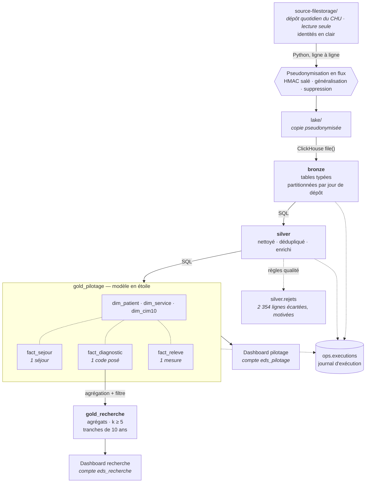

# Entrepôt de Données de Santé — CHU

**Rapport de conception** · Module Big Data M2 · Épreuve E05

---

## 1. Le besoin métier

Le CHU dispose de données éparpillées entre quatre systèmes — dossier patient,
urgences, laboratoire, monitoring des chambres — exportées chaque jour dans des
formats hétérogènes (CSV, JSON imbriqué, Parquet). Personne ne peut aujourd'hui
répondre à une question transverse sans consolider ces exports à la main.

Deux publics, aux besoins opposés :

|                            | Attend                                     | Granularité requise           |
| -------------------------- | ------------------------------------------ | ----------------------------- |
| **Direction hospitalière** | Piloter l'activité et la qualité des soins | Fine, par service et par jour |
| **Recherche clinique**     | Décrire des cohortes de patients           | Agrégée, jamais individuelle  |

Six indicateurs sont demandés : durée moyenne de séjour par service, passages
aux urgences par jour, taux de réadmission à 30 jours, relevés de constantes en
alerte, prévalence par pathologie, distribution par âge et sexe.

**La contrainte qui structure tout le projet** : il s'agit de données de santé,
catégorie particulière au sens de l'article 9 du RGPD. Les fichiers sources
contiennent l'identité réelle des patients — nom, prénom, numéro de sécurité
sociale, date de naissance complète. La conformité n'est donc pas une couche
ajoutée en fin de chaîne : c'est une contrainte de conception présente à chaque
étape, et elle explique la majorité des choix ci-dessous.

---

## 2. Les choix et leur justification

### 2.1 Une exploration avant toute décision

Cinq sources ont été profilées avant d'écrire la moindre ligne de pipeline. Ce
travail a produit trois constats qui ont directement déterminé l'architecture,
et qu'aucune lecture du cahier des charges ne laissait deviner.

**`patients` est un snapshot cumulatif, les trois autres sources sont des
deltas.** Chaque fichier journalier de patients contient toute la population
connue à date : 16 200 lignes pour 6 000 patients réels. Les séjours,
diagnostics et relevés n'apparaissent au contraire qu'une fois. Appliquer la
même stratégie d'ingestion aux quatre sources aurait multiplié par 2,7 tout
indicateur rapporté au patient.

**Le monitoring déborde de son jour de dépôt.** Le fichier du 26 août contient
des relevés jusqu'au 28. Agréger sur le jour de dépôt attribuerait au 26 des
alertes survenues deux jours plus tard : l'agrégation se fait donc sur
l'horodatage de la mesure.

**Les valeurs aberrantes du monitoring sont une panne de capteur, pas du bruit.**
Fréquence cardiaque et saturation sont *toujours* invalides ensemble — 1 369 fois
les deux, jamais l'une seule — sur exactement quatre combinaisons de butée :
(0 ou 500 bpm) × (0 ou 120 %). Le relevé entier est écarté : un capteur
déconnecté ne garantit la fiabilité d'aucune de ses mesures.

### 2.2 La pseudonymisation, au plus tôt possible

Le cahier des charges demande de pseudonymiser « à l'entrée du lake » tout en
décrivant par ailleurs le lake comme une « copie brute ». Ces deux exigences
sont incompatibles. **Nous avons tranché en faveur de la minimisation RGPD** :
le lake contient une copie fidèle mais pseudonymisée.

La transformation s'applique **au fil de la copie, ligne par ligne**. Les
identités ne sont donc écrites nulle part — pas même dans un répertoire
temporaire — et l'empreinte mémoire ne dépend pas de la taille des fichiers.

| Donnée source          | Traitement                          | Justification                                                                                                                              |
| ---------------------- | ----------------------------------- | ------------------------------------------------------------------------------------------------------------------------------------------ |
| `patient_id` (IPP)     | HMAC-SHA256 salé, tronqué à 64 bits | Déterministe pour préserver les jointures, salé parce que l'espace des IPP est énumérable — un SHA-256 nu serait cassable par dictionnaire |
| `nir`, `nom`, `prenom` | Supprimés                           | Directement identifiants, sans usage pour les indicateurs demandés                                                                         |
| `birth_date`           | Généralisée à l'année               | Aucun indicateur ne requiert la date exacte                                                                                                |

Un contrôle automatisé rejoue les **17 503 valeurs identifiantes** de la source
contre l'intégralité du lake et échoue si l'une d'elles y apparaît. Il vérifie
également l'absence de collision de pseudonyme et la préservation des jointures.

### 2.3 Un cloisonnement physique, pas conventionnel

Le sujet définit **deux publics** et ce que chacun doit voir : au pilotage la
durée de séjour, l'activité des urgences, la réadmission et la surveillance des
constantes ; à la recherche la prévalence par pathologie et la description de
cohorte. Il en tire une contrainte explicite — « pilotage et recherche ne voient
pas les mêmes données → droits d'accès distincts ».

Un filtre applicatif serait contournable par quiconque écrit sa propre requête.
Nous avons donc séparé **physiquement** : deux bases ClickHouse, deux comptes de
lecture, des droits disjoints.

**Trois rôles au total**, aux vocations distinctes :

| Rôle                         | Vocation                                                                             | Ce qu'il peut atteindre                                   |
| ---------------------------- | ------------------------------------------------------------------------------------ | --------------------------------------------------------- |
| Direction hospitalière       | Piloter l'activité et la qualité des soins                                           | Le tableau de bord Pilotage. Aucune base, aucune requête  |
| Recherche clinique           | Décrire des cohortes, sous contrainte de petits effectifs                            | Le tableau de bord Recherche. Aucune base, aucune requête |
| Administration de l'entrepôt | Exploiter le pipeline, accorder les habilitations, assurer traçabilité et conformité | L'ensemble, y compris bronze et silver                    |

**Un utilisateur métier consomme des indicateurs ; il n'interroge pas
l'entrepôt.** Les deux comptes de restitution n'ont ni éditeur SQL ni générateur
de requêtes — dans l'outil, ils ne voient aucune base de données. Cette
distinction est essentielle ici : la couche gold contient les faits **au grain de
l'événement**, avec le pseudonyme patient. Un compte de pilotage disposant de
l'éditeur SQL pourrait lire `fact_sejour` ligne par ligne, ce qui excède
largement son besoin. Il consulte donc des questions enregistrées, préparées et
agrégées, sans jamais atteindre la table.

Le troisième rôle n'est pas une commodité technique : dans un entrepôt de données
de santé, quelqu'un doit pouvoir **remonter à la ligne d'origine** — pour
diagnostiquer un incident, produire une piste d'audit, ou exécuter une demande
d'effacement au titre du RGPD. C'est précisément ce que les colonnes
`_fichier_source` et `_run_id` rendent possible, et l'administrateur est le seul
à y avoir accès. Ni le pilotage ni la recherche ne peuvent atteindre le détail,
fût-il pseudonymisé.

**Quatre comptes de service ClickHouse**, à ne pas confondre avec les trois
rôles : `eds_admin` pour le pipeline, `eds_pilotage` et `eds_recherche` pour les
deux connexions de restitution, et `eds_exploitation` — en **lecture seule** sur
`bronze`, `silver` et `ops` — pour l'investigation.

**Les droits de restitution sont posés colonne par colonne.** C'est la
conséquence directe du choix d'un modèle en étoile : la couche gold contenant les
faits au grain de l'événement, un `GRANT` sur la base entière donnerait au
pilotage l'accès à `patient_pseudo` et à `stay_id`. Or la direction consulte des
indicateurs d'activité — elle n'a jamais à désigner un patient ni à relier deux
séjours.

`eds_pilotage` ne dispose donc que des **16 colonnes** que ses tableaux de bord
utilisent : codes de service, dates, tranches d'âge, durées et drapeaux
d'alerte. Ni le pseudonyme, ni l'identifiant de séjour, ni les horodatages
précis, ni les constantes brutes ; `dim_patient` et `fact_diagnostic` ne lui sont
pas accordées du tout. Vérifié : il ne peut ni lire le pseudonyme, ni dénombrer
des patients, ni exécuter un `SELECT *` — et il calcule sans difficulté la DMS,
les passages aux urgences et les relevés en alerte.

Cette borne ne dépend pas du compte humain mais du compte de service : **même
l'administrateur ne peut pas lire le pseudonyme s'il passe par la connexion de
pilotage**. Il doit emprunter la connexion d'exploitation, dont l'usage est
tracé.

Ce dernier mérite d'être justifié. L'administration aurait pu investiguer avec le
compte du pipeline, qui a tous les droits. Nous ne l'avons pas fait :
`eds_admin` peut créer et supprimer des bases, et ce pouvoir n'a pas sa place
derrière une interface web où une requête maladroite suffirait. Le compte
d'exploitation applique le moindre privilège — il lit tout ce qui est nécessaire
à une investigation, et le moteur lui refuse toute écriture. Ni l'un ni l'autre n'a accès aux couches bronze et silver,
ce qui interdit de remonter au détail.

Le refus est prononcé par le moteur, **y compris depuis l'éditeur SQL de
Metabase**, qui se connecte avec ces comptes cloisonnés et jamais avec le compte
d'administration.

Ce choix impose que les indicateurs soient des **tables matérialisées et non des
vues** : en ClickHouse une vue s'exécute avec les droits de l'appelant, si bien
qu'une vue gold obligerait à ouvrir aussi l'accès à silver — et le cloisonnement
s'effondrerait.

### 2.4 Le risque de ré-identification, mesuré puis corrigé

La généralisation à l'année demandée par le sujet **ne suffit pas**. Mesure du
k-anonymat sur les quasi-identifiants restants :

| Granularité de l'âge  | Population à k ≥ 5 | Patients uniques | Cohortes sous le seuil |
| --------------------- | ------------------ | ---------------- | ---------------------- |
| Année de naissance    | 58,3 %             | **102**          | 284                    |
| **Tranche de 10 ans** | **100 %**          | **0**            | **0**                  |

D'où la règle retenue : l'année n'existe qu'en pilotage, accès restreint ; la
base recherche n'expose que des tranches de dix ans. Le filtre des petits
effectifs (`>= 5 patients`) est appliqué **à l'écriture**, de sorte qu'aucune
donnée sous le seuil n'existe dans cette base — il n'y a rien à penser à masquer
au moment de la lecture.

### 2.5 Un modèle en étoile, pas un catalogue de KPI

La couche gold aurait pu se réduire à une table par indicateur — une DMS
pré-calculée, un taux de réadmission pré-calculé. Ce raccourci a un défaut
rédhibitoire : **il fige les questions**. Croiser la durée de séjour par
service *et* par tranche d'âge aurait exigé d'avoir anticipé cette combinaison
précise et d'ajouter une table.

Nous avons donc modélisé en étoile : **trois tables de faits, à trois grains
distincts, partageant des dimensions conformes**.

| Fait              | Grain                         | Volume |
| ----------------- | ----------------------------- | ------ |
| `fact_sejour`     | un séjour                     | 14 864 |
| `fact_diagnostic` | un code posé lors d'un séjour | 37 040 |
| `fact_releve`     | une mesure au chevet          | 64 799 |

Dimensions : `dim_patient`, `dim_service`, `dim_cim10`.


**Pourquoi trois faits et non un seul.** Les grains sont incompatibles : un
séjour porte 1 à 4 diagnostics et 0 à n relevés. Les fusionner en une table
unique multiplierait les lignes et fausserait toute somme — c'est le *fan trap*
classique. Une DMS calculée sur une table jointe aux relevés compterait chaque
séjour autant de fois qu'il a de mesures.

**Deux dénormalisations assumées.** `fact_diagnostic` porte le pseudonyme
patient, son âge et son sexe, recopiés depuis le séjour : les questions de
recherche portent sur des cohortes de patients par pathologie, et cette copie
leur évite deux jointures systématiques. De même, le drapeau de réadmission est
calculé **une fois** dans `fact_sejour` plutôt que laissé à l'outil de
restitution : c'est une auto-jointure, impraticable dans Metabase.

**L'âge est un attribut du fait, pas de la dimension.** `dim_patient` ne porte
pas d'âge : celui-ci dépend de la date de l'événement. C'est `age_au_sejour` et
`tranche_age` qui vivent dans les faits.

**Le prix de ce choix.** Les faits sont au grain de l'événement et portent le
pseudonyme patient. Ils ne peuvent donc pas être exposés à la recherche, qui
pourrait y reconstituer des cohortes sous le seuil. Ils vivent dans
`gold_pilotage`, dont l'accès est restreint ; la recherche reçoit des agrégats
dérivés de ces mêmes faits. C'est un arbitrage entre liberté d'analyse et
exposition, tranché différemment selon le public.

### 2.6 Le traitement s'exécute dans le moteur

Le lake est monté en lecture seule dans ClickHouse, qui lit lui-même les
fichiers CSV, JSON et Parquet via `file()`. **Python n'envoie que du SQL** :
aucune donnée ne transite par sa mémoire. C'est l'inverse de l'anti-pattern qui
consiste à extraire les données pour les transformer avec pandas.

### 2.7 Incrémental en amont, recalcul en aval

Bronze est partitionné par jour de dépôt : rejouer un jour supprime sa partition
et la réécrit, sans toucher aux autres. Silver et gold sont au contraire
**recalculés intégralement** à chaque exécution — 0,15 seconde à ce volume.

Ce choix garantit qu'un rejeu produit exactement le même état, avec un mécanisme
explicable en une phrase. Sa limite est réelle et assumée : il ne tiendrait pas
sur plusieurs années d'historique (voir § 3.3).

### 2.8 Rien n'est perdu silencieusement

Chaque ligne écartée est écrite dans `silver.rejets` avec son motif. La propriété
en découle et se vérifie en une requête :

```
sejours      14 864 + 136   = 15 000
diagnostics  37 040 + 340   = 37 380
monitoring   64 799 + 1 878 = 66 677
```

**Pour chaque source, silver + rejets = bronze, à la ligne près.** C'est ce qui
distingue écarter une donnée de la perdre.

### 2.9 Ce qui change à chaque passage de couche

Le sujet demande de « justifier chaque chiffre ». Voici, frontière par
frontière, ce que subit la donnée — et l'effet chiffré de chaque opération.

#### Source → Lake · pseudonymisation

Seules `patients` et `sejours` sont transformées : ce sont les deux seules
sources portant de l'identité. Les trois autres sont recopiées à l'octet près.

| Opération                       | Effet                                                                                                           |
| ------------------------------- | --------------------------------------------------------------------------------------------------------------- |
| `patient_id` → `patient_pseudo` | HMAC-SHA256 salé, tronqué à 64 bits. Appliqué **aux deux sources** avec le même sel, pour préserver la jointure |
| `birth_date` → `birth_year`     | Généralisation. `1933-12-09` devient `1933`                                                                     |
| `nir`, `nom`, `prenom`          | **Supprimés** — 3 colonnes sur 7 disparaissent de `patients`                                                    |
| Volumétrie                      | **inchangée** : 16 200 lignes entrent, 16 200 sortent                                                           |

#### Lake → Bronze · typage et mise en forme tabulaire

Aucune ligne n'est écartée à ce stade. C'est délibéré : on ne peut compter
que ce qu'on a laissé entrer.

| Opération                      | Effet                                                                                                     |
| ------------------------------ | --------------------------------------------------------------------------------------------------------- |
| Typage explicite               | `String` → `DateTime`, `UInt16`, `Decimal(4,1)`, `LowCardinality`                                         |
| `discharge_ts` vide → `NULL`   | 1 190 séjours en cours préservés comme tels, et non datés par défaut                                      |
| Aplatissement du JSON          | 15 000 objets imbriqués → **37 380 lignes**, une par code posé. Aucune donnée créée ni perdue             |
| Types larges et signés         | `Int16` pour la fréquence cardiaque : les 1 369 relevés aberrants **peuvent entrer** et donc être comptés |
| Partitionnement                | Par jour de dépôt — c'est ce qui rend le rejeu d'un jour possible                                         |
| Ajout de 4 colonnes techniques | `_jour_depot`, `_fichier_source`, `_ingested_at`, `_run_id`                                               |

#### Bronze → Silver · qualité, déduplication, enrichissement

C'est la seule frontière où des lignes sont écartées, et chacune l'est avec
son motif.

| Table         | Entrée | Sortie     | Opération                                                            |
| ------------- | ------ | ---------- | -------------------------------------------------------------------- |
| `patients`    | 16 200 | **6 000**  | Déduplication du snapshot cumulatif : `argMax` sur le jour de dépôt  |
| `sejours`     | 15 000 | **14 864** | −136 incohérences temporelles (`discharge_ts < admission_ts`)        |
| `diagnostics` | 37 380 | **37 040** | −340 rattachés à un séjour écarté                                    |
| `monitoring`  | 66 677 | **64 799** | −1 369 capteur hors plage, −509 séjour écarté (11 cumulent les deux) |
| `rejets`      | —      | **2 354**  | Toute ligne écartée, avec son motif et son détail                    |

Colonnes ajoutées par calcul ou par jointure :

| Colonne                                                | Origine                                                                                                                                                                  |
| ------------------------------------------------------ | ------------------------------------------------------------------------------------------------------------------------------------------------------------------------ |
| `duree_jours`                                          | `dateDiff` admission → sortie. **NULL** si séjour en cours                                                                                                               |
| `est_en_cours`                                         | `discharge_ts IS NULL`                                                                                                                                                   |
| `age_au_sejour`                                        | `toYear(admission_ts) − birth_year` — approximé à l'année                                                                                                                |
| `service_label`                                        | Jointure avec le référentiel des services                                                                                                                                |
| `libelle`                                              | Jointure avec la nomenclature CIM-10                                                                                                                                     |
| `alerte_fc`, `alerte_spo2`, `alerte_temp`, `en_alerte` | Application des seuils                                                                                                                                                   |
| `discharge_mode`                                       | Normalisation : `''` → `'inconnu'` — **1 975 séjours**. La source en compte 1 992 : les 17 autres cumulaient l'incohérence temporelle et sont partis avec les 136 exclus |

#### Silver → Gold · modélisation dimensionnelle

Aucune ligne n'est perdue vers `gold_pilotage` : les trois faits reprennent
exactement les volumes de silver. La transformation est structurelle.

| Opération                         | Effet                                                                                              |
| --------------------------------- | -------------------------------------------------------------------------------------------------- |
| Éclatement en faits et dimensions | 4 tables silver → 3 faits + 3 dimensions                                                           |
| `tranche_age`                     | Calculée dans les faits, par tranches de 10 ans                                                    |
| `est_urgence`                     | `admission_mode = 'urgence'`                                                                       |
| `est_sejour_index`                | Clos **et** patient non décédé — dénominateur de la réadmission                                    |
| `suivi_readmission_30j`           | Auto-jointure résolue **une fois**, à la construction                                              |
| Dénormalisation                   | `patient_pseudo`, `tranche_age`, `sexe` recopiés dans `fact_diagnostic`                            |
| Axes temporels                    | `date_admission` pour les séjours, **`date_mesure`** pour les relevés — la mesure, jamais le dépôt |

Vers `gold_recherche`, en revanche, la réduction est massive et volontaire :

| Opération                 | Effet                                                                 |
| ------------------------- | --------------------------------------------------------------------- |
| Agrégation                | 37 040 lignes de faits → **10** prévalences et **200** cohortes       |
| `HAVING >= 5 patients`    | Filtre appliqué **à l'écriture** : aucune cohorte sous seuil n'existe |
| Généralisation de l'âge   | Tranches de 10 ans uniquement — `birth_year` absent                   |
| Suppression du pseudonyme | `patient_pseudo` n'est pas exposé                                     |

#### Bilan

| Couche             | Lignes           | Détail                                                                                   | Ce qu'elle garantit                                    |
| ------------------ | ---------------- | ---------------------------------------------------------------------------------------- | ------------------------------------------------------ |
| **Lake**           | 46 200 + Parquet | 14 fichiers                                                                              | Copie fidèle, **sans aucune identité**                 |
| **Bronze**         | **135 275**      | patients 16 200 · séjours 15 000 · diagnostics 37 380 · relevés 66 677 · référentiels 18 | Typé, partitionné, traçable jusqu'au fichier d'origine |
| **Silver**         | **125 057**      | patients 6 000 · séjours 14 864 · diagnostics 37 040 · relevés 64 799 · **rejets 2 354** | Nettoyé, cohérent, enrichi — chaque exclusion motivée  |
| **Gold pilotage**  | **122 721**      | 3 faits (14 864 + 37 040 + 64 799) · 3 dimensions (6018)                                 | Modèle dimensionnel interrogeable librement            |
| **Gold recherche** | **210**          | prévalences 10 · cohortes 200                                                            | Agrégats anonymisés, k ≥ 5, aucun pseudonyme           |

---

## 3. Architecture, limites et recommandations

### 3.1 Schéma



Les identités n'existent que dans la source, fournie et non versionnée. La
frontière de pseudonymisation est franchie **une seule fois**, en Python, avant
toute écriture persistante.

### 3.2 Traçabilité

Chaque ligne de bronze et de silver porte **le jour de dépôt, le fichier dont
elle provient** et l'identifiant du run qui l'a produite, plus son horodatage —
d'ingestion en bronze, de construction en silver. La question *« cette donnée,
d'où vient-elle et quand a-t-elle été traitée ? »* se répond donc en une
requête, sans jointure entre couches.

La propriété vaut aussi pour ce qui a été **écarté** : `silver.rejets` porte la
même provenance. On peut donc remonter d'un problème de qualité au fichier de
dépôt qui l'a introduit — c'est ce que demande une investigation réelle.

Trois nuances assumées. En silver, `patients` est une réduction de plusieurs
lignes bronze (snapshot cumulatif) : sa provenance est celle de la **version
retenue**, d'où les colonnes `_jour_depot_retenu` et `_fichier_source_retenu`.
Pour `monitoring`, `_jour_depot` désigne le jour du fichier, jamais celui de la
mesure — les deux diffèrent, le flux débordant de son jour de dépôt.

Enfin, les deux **référentiels** (`ref_services`, `ref_cim10`) portent le
fichier d'origine mais pas de colonne `_jour_depot`, et ne sont pas
partitionnés. Ce ne sont pas des données journalières : ils sont rechargés en
entier à chaque exécution, et leur chemin de fichier —
`lake/referentiels/2026-08-26/services.csv` — contient déjà le jour. Une
colonne de plus n'aurait rien ajouté qu'un doublon.

**Gold s'arrête volontairement à `_run_id` et `_built_at`.** La provenance
fichier y serait inexploitable : le compte de pilotage n'a pas même le droit de
lire `stay_id`, et une investigation passe par la connexion d'exploitation, donc
par silver et bronze. Ce qu'on veut savoir de gold, c'est quelle exécution l'a
produit — pas de quel dépôt vient une moyenne.

La table `ops.executions` enregistre chaque étape — durée, volume, statut,
cause d'échec. Aucune donnée de santé n'entre dans ce journal.

### 3.3 Limites

**L'historique de 3 jours invalide le taux de réadmission.** La fenêtre
d'observation est plus courte que celle de l'indicateur : les délais constatés
vont de 0 à 3 jours. Le taux affiché est un **plancher**, pas une mesure. Il
faut au moins 30 jours — 90 pour une tendance — avant de l'exploiter.

**Le monitoring ne couvre que 10 % des séjours**, sur deux services (Réanimation
40,6 %, Cardiologie 39,5 %). Les six autres n'ont aucun relevé. Les indicateurs
de constantes sont explicitement restreints à ce périmètre et ne sont pas
extrapolables.

**Les seuils d'alerte ne sont pas fournis par le CHU.** Ceux retenus — FC hors
[40, 120], SpO2 < 92 %, température > 38,5 °C — sont conventionnels et doivent
être validés médicalement avant tout usage clinique.

**Le recalcul intégral de silver et gold ne passera pas à l'échelle.** Il est
instantané sur 67 000 relevés ; il deviendra le goulot d'étranglement au-delà de
quelques dizaines de millions de lignes.

**L'âge est approximé à l'année**, conséquence directe de la généralisation
RGPD. Erreur maximale : un an.

**Les données fournies sont synthétiques et uniformément distribuées.** Les
écarts entre services sont négligeables — DMS de 6,01 à 6,23 jours, taux
d'alerte de 5,8 % à 6,3 %. La plateforme restitue fidèlement ce que contiennent
les sources ; aucune conclusion médicale ne peut en être tirée.

**Les fichiers sources ne sont pas versionnés.** Un clone du dépôt ne suffit
donc pas à exécuter le pipeline : il faut y placer le dépôt du CHU. C'est un
choix délibéré — faire entrer des identités de patients dans un historique Git,
d'où elles ne peuvent plus être retirées, serait contradictoire avec l'objet
même de ce projet.

**Les faits exposent le grain de l'événement au compte pilotage — écart assumé
au §6.** Le sujet décrit la couche gold comme des « indicateurs par usage », ce
qui suggère des agrégats. Le modèle en étoile retenu va au-delà : `fact_sejour`
contient une ligne par séjour avec son pseudonyme patient, si bien que le compte
pilotage peut compter des patients, ce qu'un entrepôt de KPI pré-agrégés lui
interdirait.

Cet écart est délibéré : il achète une liberté d'analyse que les indicateurs
figés ne permettent pas, et le croisement service × tranche d'âge du tableau de
bord en est la démonstration. Les données restent pseudonymisées et l'accès
nominatif et restreint. Le compromis mérite néanmoins d'être acté avec le DPO —
c'est le seul point où la solution donne plus que ce que le sujet demandait.

### 3.4 Recommandations

| Priorité  | Recommandation                                                                                                                                                                                     |
| --------- | -------------------------------------------------------------------------------------------------------------------------------------------------------------------------------------------------- |
| **Haute** | Étendre l'historique à 90 jours minimum avant d'exploiter le taux de réadmission. Tant que ce n'est pas fait, l'indicateur doit rester marqué comme non exploitable sur le tableau de bord.        |
| **Haute** | Faire valider les seuils d'alerte par le corps médical, et les rendre configurables plutôt que codés dans le SQL.                                                                                  |
| **Haute** | Soumettre la stratégie de pseudonymisation au DPO, en particulier la conservation du triplet (année, sexe, région) en base pilotage.                                                               |
| Moyenne   | Formaliser la gestion du sel : conservation en coffre, procédure de rotation, et conséquence assumée — sa perte rend tout rapprochement avec la source définitivement impossible.                  |
| Moyenne   | Passer silver et gold en construction incrémentale si le volume dépasse quelques dizaines de millions de lignes.                                                                                   |
| Moyenne   | Documenter avec le CHU le cas des **1 992 séjours clos sans mode de sortie dans la source** (13 % des séjours) : c'est une anomalie de saisie, à corriger à l'amont plutôt qu'à compenser en aval. |
| Basse     | Étendre l'équipement de monitoring aux autres services, ou acter que cet indicateur restera limité à deux services.                                                                                |
| Basse     | Mettre en place une purge automatique selon les durées de conservation, actuellement non définies par le CHU.                                                                                      |
