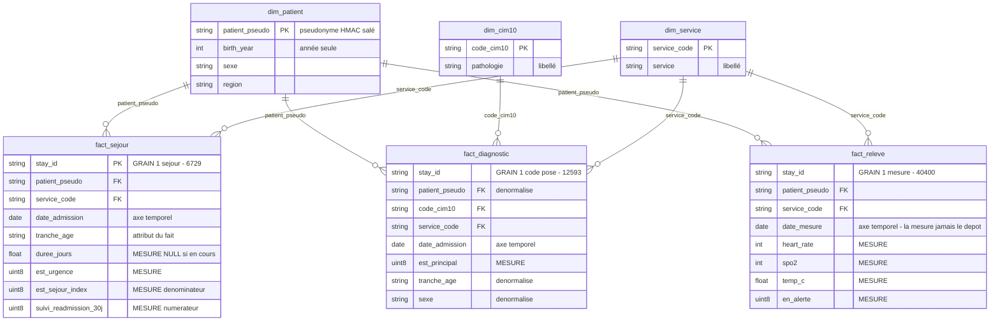
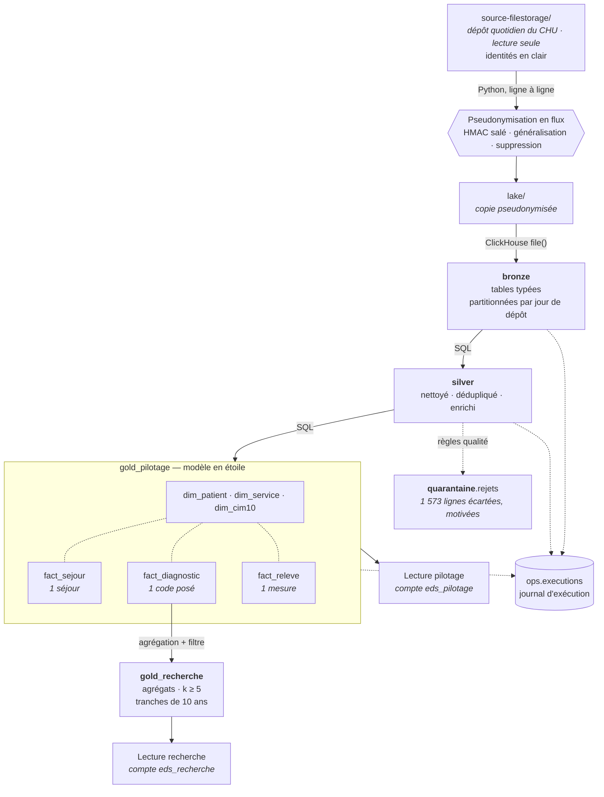

# Entrepôt de Données de Santé — CHU

**Rapport de conception** · Module Big Data M2 · Épreuve E05

---

## 1. Le besoin métier

Le CHU dispose de données éparpillées entre quatre systèmes — dossier patient,
urgences, laboratoire, monitoring des chambres — exportées chaque jour dans des
formats hétérogènes (CSV, JSON imbriqué, Parquet). Personne ne peut aujourd'hui
répondre à une question transverse sans consolider ces exports à la main.

Deux publics, aux besoins opposés :

|                            | Attend                                     | Granularité requise           |
| -------------------------- | ------------------------------------------ | ----------------------------- |
| **Direction hospitalière** | Piloter l'activité et la qualité des soins | Fine, par service et par jour |
| **Recherche clinique**     | Décrire des cohortes de patients           | Agrégée, jamais individuelle  |

Six indicateurs sont demandés : durée moyenne de séjour par service, passages
aux urgences par jour, taux de réadmission à 30 jours, relevés de constantes en
alerte, prévalence par pathologie, distribution par âge et sexe.

Les six se calculent depuis la couche gold, et `tests.verifier indicateurs` les
restitue à chaque exécution — la valeur obtenue **et** la propriété qui la
fonde. Un chiffre qui s'affiche ne prouve rien par lui-même : ce qui le rend
opposable, c'est que son dénominateur, son périmètre et ses seuils soient
vérifiés en même temps que lui. Les valeurs constatées sur le dépôt courant
figurent au § 2.10.

**La contrainte qui structure tout le projet** : il s'agit de données de santé,
catégorie particulière au sens de l'article 9 du RGPD. Les fichiers sources
contiennent l'identité réelle des patients — nom, prénom, numéro de sécurité
sociale, date de naissance complète. La conformité n'est donc pas une couche
ajoutée en fin de chaîne : c'est une contrainte de conception présente à chaque
étape, et elle explique la majorité des choix ci-dessous.

---

## 2. Les choix et leur justification

### 2.1 Une exploration avant toute décision

Cinq sources ont été profilées avant d'écrire la moindre ligne de pipeline. Ce
travail a produit trois constats qui ont directement déterminé l'architecture,
et qu'aucune lecture du cahier des charges ne laissait deviner.

**`patients` est un snapshot cumulatif, les trois autres sources sont des
deltas.** Chaque fichier journalier de patients contient toute la population
connue à date : 18 000 lignes pour 6 000 patients réels. Les séjours,
diagnostics et relevés n'apparaissent au contraire qu'une fois. Appliquer la
même stratégie d'ingestion aux quatre sources aurait multiplié par 3 tout
indicateur rapporté au patient.

**Les sources n'ont pas le même calendrier de dépôt.** Séjours, diagnostics et
relevés sont déposés les 28 jours du mois ; le snapshot `patients` ne l'est que
les trois derniers. La population de référence est donc l'**union** des dépôts,
et non celui du jour : un séjour du 1er août n'est décrit que par un fichier
arrivé 25 jours plus tard. Une lecture jour à jour prendrait ce décalage pour
une rupture d'intégrité référentielle.

**Le monitoring déborde de son jour de dépôt.** Le fichier du 1er août contient
des relevés jusqu'au 3, et le décalage se reproduit sur les 28 dépôts. Agréger
sur le jour de dépôt attribuerait au 1er des alertes survenues deux jours plus
tard : l'agrégation se fait donc sur l'horodatage de la mesure.

**Les valeurs aberrantes du monitoring sont une panne de capteur, pas du bruit.**
Fréquence cardiaque et saturation sont *toujours* invalides ensemble — 858 fois
les deux, jamais l'une seule — sur exactement quatre combinaisons de butée :
(0 ou 500 bpm) × (0 ou 120 %). Le relevé entier est écarté : un capteur
déconnecté ne garantit la fiabilité d'aucune de ses mesures.

### 2.2 La pseudonymisation, au plus tôt possible

Le cahier des charges demande de pseudonymiser « à l'entrée du lake » tout en
décrivant par ailleurs le lake comme une « copie brute ». Ces deux exigences
sont incompatibles. **Nous avons tranché en faveur de la minimisation RGPD** :
le lake contient une copie fidèle mais pseudonymisée.

La transformation s'applique **au fil de la copie, ligne par ligne**. Les
identités ne sont donc écrites nulle part — pas même dans un répertoire
temporaire — et l'empreinte mémoire ne dépend pas de la taille des fichiers.

| Donnée source          | Traitement                          | Justification                                                                                                                              |
| ---------------------- | ----------------------------------- | ------------------------------------------------------------------------------------------------------------------------------------------ |
| `patient_id` (IPP)     | HMAC-SHA256 salé, tronqué à 64 bits | Déterministe pour préserver les jointures, salé parce que l'espace des IPP est énumérable — un SHA-256 nu serait cassable par dictionnaire |
| `nir`, `nom`, `prenom` | Supprimés                           | Directement identifiants, sans usage pour les indicateurs demandés                                                                         |
| `birth_date`           | Généralisée à l'année               | Aucun indicateur ne requiert la date exacte                                                                                                |

Un contrôle automatisé rejoue les **17 384 valeurs identifiantes** de la source
contre l'intégralité du lake et échoue si l'une d'elles y apparaît. Il vérifie
également l'absence de collision de pseudonyme et la préservation des jointures.

### 2.3 Un cloisonnement physique, pas conventionnel

Le sujet définit **deux publics** et ce que chacun doit voir : au pilotage la
durée de séjour, l'activité des urgences, la réadmission et la surveillance des
constantes ; à la recherche la prévalence par pathologie et la description de
cohorte. Il en tire une contrainte explicite — « pilotage et recherche ne voient
pas les mêmes données → droits d'accès distincts ».

Un filtre applicatif serait contournable par quiconque écrit sa propre requête.
Nous avons donc séparé **physiquement** : deux bases ClickHouse, deux comptes de
lecture, des droits disjoints.

**Quatre comptes ClickHouse**, aux vocations distinctes :

| Compte             | Vocation                                                                             | Ce qu'il peut atteindre                                            |
| ------------------ | ------------------------------------------------------------------------------------ | ------------------------------------------------------------------ |
| `eds_admin`        | Exécuter le pipeline — créer les tables, appliquer les habilitations                 | Tout. C'est le compte du traitement, pas un compte d'usage         |
| `eds_pilotage`     | Direction hospitalière — piloter l'activité et la qualité des soins                  | 16 colonnes de `gold_pilotage`. Rien d'autre                       |
| `eds_recherche`    | Recherche clinique — décrire des cohortes, sous contrainte de petits effectifs       | Les deux tables d'agrégats de `gold_recherche`. Rien d'autre       |
| `eds_exploitation` | Investigation technique — incident, piste d'audit, demande d'effacement              | `bronze`, `silver`, `quarantaine`, `ops` — en **lecture seule**    |

**Le compte d'investigation n'est pas une commodité technique.** Dans un
entrepôt de données de santé, quelqu'un doit pouvoir **remonter à la ligne
d'origine** — pour diagnostiquer un incident, produire une piste d'audit, ou
exécuter une demande d'effacement au titre du RGPD. C'est précisément ce que les
colonnes `_fichier_source` et `_run_id` rendent possible. Ni le pilotage ni la
recherche n'atteignent ce détail, fût-il pseudonymisé : eux n'ont accès qu'à
gold, et seulement à leur base.

Ce compte mérite d'être justifié. L'administration aurait pu investiguer avec le
compte du pipeline, qui a tous les droits. Nous ne l'avons pas fait :
`eds_admin` peut créer et supprimer des bases, et ce pouvoir n'a pas sa place
dans un usage quotidien, où une requête maladroite suffirait. Le compte
d'exploitation applique le moindre privilège — il lit tout ce qui est nécessaire
à une investigation, et le moteur lui refuse toute écriture.

**Les droits sont posés colonne par colonne, pas base par base.** C'est la
conséquence directe du choix d'un modèle en étoile : la couche gold contenant les
faits au grain de l'événement, un `GRANT` sur la base entière donnerait au
pilotage l'accès à `patient_pseudo` et à `stay_id`. Or la direction consulte des
indicateurs d'activité — elle n'a jamais à désigner un patient ni à relier deux
séjours.

`eds_pilotage` ne dispose donc que des **16 colonnes** que ses indicateurs
utilisent : codes de service, dates, tranches d'âge, durées et drapeaux
d'alerte. Ni le pseudonyme, ni l'identifiant de séjour, ni les horodatages
précis, ni les constantes brutes ; `dim_patient` et `fact_diagnostic` ne lui sont
pas accordées du tout. Vérifié : il ne peut ni lire le pseudonyme, ni dénombrer
des patients, ni exécuter un `SELECT *` — et il calcule sans difficulté la DMS,
les passages aux urgences et les relevés en alerte.

**Cette borne ne dépend pas de qui interroge, mais du compte employé.**
Quiconque se connecte avec `eds_pilotage` — administrateur compris — se voit
opposer le même refus, prononcé par le moteur. C'est ce qui distingue un
cloisonnement d'un réglage d'interface : le jour où un outil de restitution est
branché sur ces bases, il héritera de la borne sans pouvoir la contourner, quels
que soient ses propres réglages.

Ce choix impose que les indicateurs soient des **tables matérialisées et non des
vues** : en ClickHouse une vue s'exécute avec les droits de l'appelant, si bien
qu'une vue gold obligerait à ouvrir aussi l'accès à silver — et le cloisonnement
s'effondrerait.

### 2.4 Le risque de ré-identification, mesuré puis corrigé

La généralisation à l'année demandée par le sujet **ne suffit pas**. Mesure du
k-anonymat sur les quasi-identifiants restants :

| Granularité de l'âge  | Population à k ≥ 5 | Patients uniques | Cohortes sous le seuil |
| --------------------- | ------------------ | ---------------- | ---------------------- |
| Année de naissance    | 62,3 %             | **185**          | 95                     |
| **Tranche de 10 ans** | **100 %**          | **0**            | **13**                 |

D'où la règle retenue : l'année n'existe qu'en pilotage, accès restreint ; la
base recherche n'expose que des tranches de dix ans. Le filtre des petits
effectifs (`>= 5 patients`) est appliqué **à l'écriture**, de sorte qu'aucune
donnée sous le seuil n'existe dans cette base — il n'y a rien à penser à masquer
au moment de la lecture.

**La généralisation seule ne suffit pas, et les données le montrent.** Les
tranches de dix ans ramènent toute la population à k ≥ 5, mais **treize cohortes
restent sous le seuil** : la nomenclature comporte trois pathologies rares —
mucoviscidose, amyotrophie spinale, trisomie 21 — dont les effectifs sont faibles
quelle que soit la granularité de l'âge. C'est le filtre à l'écriture, et lui
seul, qui garantit la propriété.

**Ce filtre se déclenche donc sur les données réelles.** Deux prévalences sont
supprimées à la construction — trisomie 21 (3 patients) et mucoviscidose (4) —
ainsi que treize cohortes de description : elles existent au grain du fait en
pilotage, elles n'atteignent pas `gold_recherche`. `tests.demontrer effectifs`
va plus loin et fabrique le cas limite que les données ne fournissent pas — une
pathologie portée par exactement 4 patients, une autre par exactement 5 —
reconstruit silver et gold, et constate où tombe la coupe : la première est
retenue, la seconde passe. Le seuil coupe bien *sous* 5, et non *à* 5, comme le
demande le §5.

### 2.5 Un modèle en étoile, **et** un catalogue de KPI

Le § 6 décrit gold comme des « indicateurs par usage » — une table par
indicateur. C'est le chemin de lecture le plus direct, et il correspond au
besoin courant : la direction consulte une DMS, elle ne compose pas une
requête. Mais pris seul, ce raccourci a un défaut rédhibitoire : **il fige les
questions**. Croiser la durée de séjour par service *et* par tranche d'âge, ou
la ventiler par pathologie, exige d'avoir anticipé la combinaison exacte et
d'ajouter une table.

Nous avons donc fait les deux, dans cet ordre de dérivation :

| Niveau | Contenu | Pour qui |
| --- | --- | --- |
| **Indicateurs agrégés** | `kpi_dms_service`, `kpi_urgences_jour`, `kpi_readmission_service`, `kpi_alertes_jour` | La lecture courante — un indicateur, une table, aucune jointure |
| **Modèle en étoile** | 3 faits, 3 dimensions conformes | L'analyse qu'aucune table figée ne couvre |

Les quatre tables d'indicateurs sont **dérivées des faits**, jamais de silver.
Un indicateur et le fait dont il sort doivent donner le même chiffre par
construction — et `tests.verifier indicateurs` confronte chaque table à son
recalcul depuis les faits, en cardinalité comme en valeur. Sans ce contrôle,
une table d'agrégat continuerait de servir un chiffre que plus rien ne fonde.

Chaque table porte son **effectif** à côté de sa mesure. Un taux sans son
dénominateur ne s'interprète pas : 24 % d'alertes sur 29 relevés et sur 2 000
ne se lisent pas de la même façon — c'est exactement le cas qui se présente
au dernier jour de la série.

**L'étoile, sous les indicateurs** : trois tables de faits, à trois grains
distincts, partageant des dimensions conformes.

| Fait              | Grain                         | Volume |
| ----------------- | ----------------------------- | ------ |
| `fact_sejour`     | un séjour                     | 6 729  |
| `fact_diagnostic` | un code posé lors d'un séjour | 12 593 |
| `fact_releve`     | une mesure au chevet          | 40 400 |

Dimensions : `dim_patient`, `dim_service`, `dim_cim10`.



**Pourquoi trois faits et non un seul.** Les grains sont incompatibles : un
séjour porte 1 à 3 diagnostics et 0 à n relevés. Les fusionner en une table
unique multiplierait les lignes et fausserait toute somme — c'est le *fan trap*
classique. Une DMS calculée sur une table jointe aux relevés compterait chaque
séjour autant de fois qu'il a de mesures.

**Deux dénormalisations assumées.** `fact_diagnostic` porte le pseudonyme
patient, son âge et son sexe, recopiés depuis le séjour : les questions de
recherche portent sur des cohortes de patients par pathologie, et cette copie
leur évite deux jointures systématiques. De même, le drapeau de réadmission est
calculé **une fois** dans `fact_sejour` plutôt que laissé à l'outil de
restitution : c'est une auto-jointure, hors de portée d'une requête d'analyse
ordinaire.

**Les faits se construisent sur les dimensions.** Les trois dimensions sont
écrites en premier ; les faits ensuite, et tout attribut de dimension dont un
fait a besoin est lu **dans la dimension**, jamais re-dérivé depuis silver.
C'est ce qui fait de l'étoile un modèle plutôt que trois tables qui se
ressemblent, et c'est ce qui rend l'intégrité vérifiable : sept contrôles
`fait → dimension` s'exécutent à chaque passage de `tests.verifier qualite`.

Le choix a une conséquence pratique : `fact_diagnostic` lit le sexe dans
`dim_patient` et non dans `silver.patients`. L'attribut n'a qu'une source de
vérité, et le jour où la dimension évolue — historisation, correction — les
faits suivent sans qu'on ait à y penser.

**L'âge est un attribut du fait, dérivé contre la dimension.** `dim_patient` ne
porte pas d'âge : celui-ci dépend de la date de l'événement. Mais il ne se
calcule pas non plus en silver, où on l'aurait figé trop tôt : `age_au_sejour`
croise `dim_patient.birth_year` et l'axe `date_admission` du fait, au moment où
le fait est construit. C'est la définition même d'un attribut dérivé de fait —
ni une propriété de la personne, ni une donnée de la source.

La jointure est un `LEFT JOIN` volontaire. Un séjour dont le patient serait
absent de la dimension doit rester dans le fait avec un âge `NULL`, jamais
disparaître : c'est la même règle que partout ailleurs ici — on écarte
explicitement, on ne perd pas silencieusement.

**Ce que compte une cohorte : le diagnostic principal.** Chaque séjour porte un
diagnostic principal et 0 à 2 associés — 6 729 principaux contre 5 864
associés. Les agrégats de recherche ne retiennent que le principal, c'est-à-dire
le **motif d'hospitalisation** : les patients hospitalisés *pour* cette
pathologie. Inclure les comorbidités triplerait presque le compte (725 → 2 134
patients sur l'insuffisance cardiaque, par exemple) et compterait comme cohorte
« diabète » un patient hospitalisé pour une fracture et diabétique par ailleurs.

Ce choix suit le grain du séjour, sur lequel tout l'entrepôt est construit. Il
n'est pas neutre sur le chiffre obtenu : il doit donc accompagner l'indicateur
partout où celui-ci est diffusé, et pas seulement figurer ici. Un indicateur dont
on ne dit pas ce qu'il compte n'est pas exploitable — c'est le « justifier chaque
chiffre » du §4. Le
détail par type de diagnostic reste disponible en pilotage, où `fact_diagnostic`
porte `est_principal`.

**Le prix de ce choix.** Les faits sont au grain de l'événement et portent le
pseudonyme patient. Ils ne peuvent donc pas être exposés à la recherche, qui
pourrait y reconstituer des cohortes sous le seuil. Ils vivent dans
`gold_pilotage`, dont l'accès est restreint ; la recherche reçoit des agrégats
dérivés de ces mêmes faits. C'est un arbitrage entre liberté d'analyse et
exposition, tranché différemment selon le public.

### 2.6 Le traitement s'exécute dans le moteur

Le lake est monté en lecture seule dans ClickHouse, qui lit lui-même les
fichiers CSV, JSON et Parquet via `file()`. **Python n'envoie que du SQL** :
aucune donnée ne transite par sa mémoire. C'est l'inverse de l'anti-pattern qui
consiste à extraire les données pour les transformer avec pandas.

### 2.7 Incrémental en amont, recalcul en aval

Bronze est partitionné par jour de dépôt : rejouer un jour supprime sa partition
et la réécrit, sans toucher aux autres. Silver et gold sont au contraire
**recalculés intégralement** à chaque exécution — 0,12 seconde à ce volume.

Ce choix garantit qu'un rejeu produit exactement le même état, avec un mécanisme
explicable en une phrase. Sa limite est réelle et assumée : il ne tiendrait pas
sur plusieurs années d'historique (voir § 3.3).

### 2.8 Rien n'est perdu silencieusement

Chaque ligne écartée est écrite dans `quarantaine.rejets` avec son motif. La
propriété en découle et se vérifie en une requête :

```
sejours       6 729 +    68 =  6 797
diagnostics  12 593 +   127 = 12 720
monitoring   40 400 + 1 378 = 41 778
```

**Pour chaque source, silver + quarantaine = bronze, à la ligne près.** C'est ce
qui distingue écarter une donnée de la perdre.

Une ligne fautive n'est pas toujours écartée : elle peut être **corrigée**,
lorsque la valeur inutilisable ne porte aucune clé. La colonne `action` du
registre sépare les deux issues — `'ecarte'` entre dans l'équation, `'corrige'`
est signalée sans être soustraite. Sans cette distinction, corriger une valeur
ferait disparaître une ligne du compte, ou bien la correction resterait
invisible : les deux sont inacceptables dans un registre d'incidents qualité.

**Pourquoi une base à part, et non `silver.rejets`.** Deux raisons, et aucune
n'est esthétique. D'abord le contrat de la couche : silver signifie « nettoyé,
cohérent » ; y loger la table des lignes sales brouille exactement ce que la
couche promet, et un `GRANT SELECT ON silver.*` livrait le registre avec les
données propres. Ensuite le cycle de vie : ces lignes portent `stay_id` et, dans
`detail`, les valeurs brutes fautives — c'est de la donnée de santé
pseudonymisée, mais dont la durée de conservation n'est pas celle de l'entrepôt.
On purge une quarantaine quand l'incident qualité est instruit, pas quand la
donnée expire. Une base distincte permet de lui appliquer sa propre rétention et
ses propres droits — et, le jour venu, de la confier à un référent qualité sans
lui ouvrir silver.

### 2.9 Ce qui change à chaque passage de couche

Le sujet demande de « justifier chaque chiffre ». Voici, frontière par
frontière, ce que subit la donnée — et l'effet chiffré de chaque opération.

#### Source → Lake · pseudonymisation

Seules `patients` et `sejours` sont transformées : ce sont les deux seules
sources portant de l'identité. Les trois autres sont recopiées à l'octet près.

| Opération                       | Effet                                                                                                           |
| ------------------------------- | --------------------------------------------------------------------------------------------------------------- |
| `patient_id` → `patient_pseudo` | HMAC-SHA256 salé, tronqué à 64 bits. Appliqué **aux deux sources** avec le même sel, pour préserver la jointure |
| `birth_date` → `birth_year`     | Généralisation. `1933-12-09` devient `1933`                                                                     |
| `nir`, `nom`, `prenom`          | **Supprimés** — 3 colonnes sur 7 disparaissent de `patients`                                                    |
| Volumétrie                      | **inchangée** : 24 797 lignes entrent, 24 797 sortent                                                           |

#### Lake → Bronze · typage et mise en forme tabulaire

Aucune ligne n'est écartée à ce stade. C'est délibéré : on ne peut compter
que ce qu'on a laissé entrer.

| Opération                      | Effet                                                                                                     |
| ------------------------------ | --------------------------------------------------------------------------------------------------------- |
| Typage explicite               | `String` → `DateTime`, `UInt16`, `Decimal(4,1)`, `LowCardinality`                                         |
| `discharge_ts` vide → `NULL`   | 683 séjours en cours préservés comme tels, et non datés par défaut                                        |
| Dates lues en mode **tolérant** | `parseDateTimeBestEffortOrNull` : une date illisible entre en `NULL` au lieu de faire échouer le chargement du jour entier. Un drapeau `_discharge_illisible` distingue « vide, séjour en cours » de « illisible » — que le `NULL` confondrait |
| Aplatissement du JSON          | 6 797 objets imbriqués → **12 720 lignes**, une par code posé. Aucune donnée créée ni perdue              |
| Types larges et signés         | `Int16` pour la fréquence cardiaque : les 858 relevés aberrants **peuvent entrer** et donc être comptés   |
| Partitionnement                | Par jour de dépôt — c'est ce qui rend le rejeu d'un jour possible                                         |
| Ajout de 4 colonnes techniques | `_jour_depot`, `_fichier_source`, `_ingested_at`, `_run_id`                                               |

#### Bronze → Silver · qualité, déduplication, enrichissement

C'est la seule frontière où des lignes sont écartées, et chacune l'est avec
son motif.

**Une règle décide de ce qui a le droit d'être ici.** Silver applique les règles
de **validité** que le sujet fournit — plages physiologiques, cohérence
temporelle, déduplication. Les règles **métier**, que le sujet ne fournit pas et
qui se paramètrent, appartiennent à gold : les seuils d'alerte et l'âge à
l'événement n'y sont donc pas. Cette frontière n'est pas une convention de style,
elle se vérifie (`tests.verifier qualite` échoue si silver recalcule un âge ou
une alerte).

| Table         | Entrée | Sortie     | Opération                                                            |
| ------------- | ------ | ---------- | -------------------------------------------------------------------- |
| `patients`    | 18 000 | **6 000**  | Déduplication du snapshot cumulatif : `argMax` sur le jour de dépôt — 118 patients ont un attribut divergent entre redépôts ; sexe normalisé `upper(trim(…))`, hors M/F → `'inconnu'` |
| `sejours`     | 6 797  | **6 729**  | −68 incohérences temporelles (`discharge_ts < admission_ts`), −0 date illisible |
| `diagnostics` | 12 720 | **12 593** | −127 rattachés à un séjour écarté                                    |
| `monitoring`  | 41 778 | **40 400** | −858 capteur hors plage, −520 séjour écarté (8 cumulent les deux)    |
| `quarantaine` | —      | **1 573**  | Toute ligne écartée (`action = 'ecarte'`) ou corrigée (`'corrige'`), avec son motif et son détail |

**Les deux contrôles de format du §3 ne se déclenchent pas sur ces données.**
« Dates valides » et « sexe normalisé (M/F) » : la source est propre sur les
deux — 9 045 M, 8 955 F, aucune date illisible. Les règles sont néanmoins
implémentées, et **exercées** : `tests.demontrer qualite` injecte en bronze les
quatre lignes fautives que la source ne contient pas, reconstruit silver
dessus, et constate le sort de chacune avant de remettre l'entrepôt en état. Une
règle qu'aucune donnée n'exerce ne prouve rien.

Ces deux contrôles n'ont pas la même issue, et c'est délibéré :

| Anomalie | Issue | Pourquoi |
| --- | --- | --- |
| Date d'admission illisible, ou date de sortie non vide et illisible | **Écartée** | Sans date fiable, ni la durée de séjour ni le rattachement d'un relevé ne tiennent. Le contrôle passe **avant** la cohérence temporelle : sinon la comparaison porterait sur un `NULL` et la ligne échapperait aux deux |
| Sexe hors nomenclature | **Corrigée** en `'inconnu'`, ligne conservée et signalée | Écarter le patient orphelinerait tous ses séjours, pour un attribut purement descriptif qui n'entre dans aucune clé |

C'est ce que distingue la colonne `action` de la quarantaine. Sans elle, une
correction fausserait l'équation de conservation ou resterait invisible.

Colonnes ajoutées par calcul ou par jointure :

| Colonne                                                | Origine                                                                                                                                                                  |
| ------------------------------------------------------ | ------------------------------------------------------------------------------------------------------------------------------------------------------------------------ |
| `duree_jours`                                          | `dateDiff` admission → sortie. **NULL** si séjour en cours                                                                                                               |
| `est_en_cours`                                         | `discharge_ts IS NULL`                                                                                                                                                   |
| `service_label`                                        | Jointure avec le référentiel des services                                                                                                                                |
| `libelle`                                              | Jointure avec la nomenclature CIM-10                                                                                                                                     |
| `discharge_mode`                                       | Normalisation : `''` → `'inconnu'` — **683 séjours**, tous en cours. Aucun séjour clos n'est privé de mode de sortie dans ce dépôt : la règle est en place, elle n'a ici à traiter que le cas légitime |

#### Silver → Gold · modélisation dimensionnelle

Aucune ligne n'est perdue vers `gold_pilotage` : les trois faits reprennent
exactement les volumes de silver. La transformation est structurelle.

| Opération                         | Effet                                                                                              |
| --------------------------------- | -------------------------------------------------------------------------------------------------- |
| Éclatement en faits et dimensions | 4 tables silver → 3 faits + 3 dimensions, **les dimensions d'abord**                               |
| `age_au_sejour`                   | `toYear(date_admission) − dim_patient.birth_year` — dérivé **contre la dimension**, approximé à l'année |
| `tranche_age`                     | Calculée dans les faits, par tranches de 10 ans                                                    |
| `sexe`                            | Lu dans `dim_patient`, source de vérité unique                                                     |
| `alerte_fc`, `alerte_spo2`, `alerte_temp`, `en_alerte` | Application des seuils **paramétrés** (`eds/config.py`) — règle métier, pas règle de validité |
| `est_urgence`                     | `admission_mode = 'urgence'`                                                                       |
| `est_sejour_index`                | Clos **et** patient non décédé — dénominateur de la réadmission                                    |
| `suivi_readmission_30j`           | Auto-jointure résolue **une fois**, à la construction                                              |
| Dénormalisation                   | `patient_pseudo`, `tranche_age`, `sexe` recopiés dans `fact_diagnostic`                            |
| Axes temporels                    | `date_admission` pour les séjours, **`date_mesure`** pour les relevés — la mesure, jamais le dépôt |

Puis, **dérivés de ces faits**, les quatre indicateurs agrégés du pilotage :

| Table | Grain | Lignes |
| --- | --- | --- |
| `kpi_dms_service` | service × mois | 8 |
| `kpi_urgences_jour` | jour d'admission | 28 |
| `kpi_readmission_service` | service | 8 |
| `kpi_alertes_jour` | jour de mesure × service | 59 |

Aucune information n'y est créée : ce sont des `GROUP BY` sur les faits, et
l'égalité est vérifiée table par table. Chacune expose son effectif à côté de
sa mesure, et `kpi_readmission_service` expose numérateur et dénominateur en
plus du taux — de quoi recomposer l'indicateur sur un autre périmètre.

Vers `gold_recherche`, en revanche, la réduction est massive et volontaire :

| Opération                 | Effet                                                                 |
| ------------------------- | --------------------------------------------------------------------- |
| Filtre `est_principal`    | Seul le motif d'hospitalisation est retenu : 6 729 diagnostics sur 12 593 |
| Agrégation                | 12 593 lignes de faits → **11** prévalences et **89** cohortes        |
| `HAVING >= 5 patients`    | Filtre appliqué **à l'écriture** : aucune cohorte sous seuil n'existe. Il retire ici 2 prévalences et 13 cohortes |
| Généralisation de l'âge   | Tranches de 10 ans uniquement — `birth_year` absent                   |
| Suppression du pseudonyme | `patient_pseudo` n'est pas exposé                                     |

#### Bilan

| Couche             | Lignes           | Détail                                                                                  | Ce qu'elle garantit                                    |
| ------------------ | ---------------- | --------------------------------------------------------------------------------------- | ------------------------------------------------------ |
| **Lake**           | 24 818 + Parquet | 89 fichiers                                                                             | Copie fidèle, **sans aucune identité**                 |
| **Bronze**         | **79 316**       | patients 18 000 · séjours 6 797 · diagnostics 12 720 · relevés 41 778 · référentiels 21 | Typé, partitionné, traçable jusqu'au fichier d'origine |
| **Silver**         | **65 722**       | patients 6 000 · séjours 6 729 · diagnostics 12 593 · relevés 40 400                    | Nettoyé, cohérent, enrichi — et rien d'autre           |
| **Quarantaine**    | **1 573**        | toute ligne écartée, avec son motif, son détail et sa provenance                        | Rien n'est perdu silencieusement                       |
| **Gold pilotage**  | **65 743**       | 3 faits (6 729 + 12 593 + 40 400) · 3 dimensions (6 021)                                | Modèle dimensionnel interrogeable librement            |
| **Gold recherche** | **100**          | prévalences 11 · cohortes 89                                                            | Agrégats anonymisés, k ≥ 5, aucun pseudonyme           |


### 2.10 Les six indicateurs, et ce qui les rend opposables

Le § 4 du sujet demande de « justifier chaque chiffre ». Un tableau de bord
affiche une valeur ; il ne dit pas sur quel dénominateur elle est calculée, ni
si le périmètre annoncé est celui qui a servi. `tests.verifier indicateurs`
restitue donc les six valeurs **et** les propriétés qui les fondent, dans la
même exécution : si l'une tombe, le chiffre affiché à côté est faux, et le
contrôle échoue avant qu'il ne soit diffusé.

| Indicateur | Valeur sur le dépôt courant | Ce qui est vérifié en même temps |
| --- | --- | --- |
| **DMS par service** | 2,15 j (Urgences) à 9,05 j (Réanimation), sur 6 046 séjours clos | Les 8 services du référentiel sont représentés ; le dénominateur est exactement l'ensemble des séjours **clos** ; aucune durée manquante parmi eux |
| **Passages aux urgences par jour** | 3 327 passages, 18 à 158 par jour sur 28 jours | La série journalière somme au total ; `est_urgence` ne qualifie que les admissions en urgence ; l'axe est la date d'**admission**, jamais le jour de dépôt |
| **Réadmission à 30 jours** | 12,81 % — 647 réadmissions sur 5 051 séjours index | Le numérateur est inclus dans le dénominateur ; aucune réadmission portée par un séjour hors dénominateur ; ni décès ni séjour en cours au dénominateur |
| **Relevés en alerte** | 2 453 sur 40 400 (6,1 %) — FC 274 · SpO2 1 108 · T° 1 071 | `en_alerte` est bien la réunion des trois motifs ; **les drapeaux sont recalculés depuis `eds/config.py`** et doivent coïncider — ce qui prouve que le seuil configuré est celui qui a servi, et non une constante figée dans le SQL |
| **Prévalence par pathologie** | 11 pathologies, de 8 à 847 patients | L'agrégat reproduit exactement le recalcul depuis `fact_diagnostic` filtré sur le diagnostic principal ; `nb_sejours >= nb_patients` ; toute pathologie restituée existe dans la nomenclature |
| **Distribution âge × sexe** | 89 cohortes, tranches 0-9 à 90-99 | Aucune tranche `inconnu` ; sexe borné à la nomenclature ; la somme des cases d'une pathologie ne dépasse pas son effectif de prévalence ; aucune pathologie décrite hors prévalence |

**Chaque indicateur du pilotage existe en deux exemplaires**, et c'est
délibéré : la table agrégée, qui est le chemin de lecture, et le fait, qui
est la source de vérité. Un cinquième contrôle par indicateur confronte les
deux — même nombre de lignes, mêmes valeurs. C'est ce qui empêche une table
d'agrégat de dériver en silence après un changement de règle appliqué d'un
seul côté.

**Le contrôle le plus utile est celui des seuils d'alerte.** Ils sont
présentés comme un paramètre d'exploitation, surchargeable par l'environnement
sans toucher au SQL (§ 3.3). Cette affirmation serait invérifiable si le
contrôle se contentait de compter les alertes : recalculer les drapeaux à
partir de la valeur lue dans la configuration, et exiger l'égalité, est ce qui
transforme la promesse en propriété. Changer `EDS_SEUIL_FC_BASSE` et relancer
déplace les deux côtés de l'égalité ensemble ; laisser un seuil en dur dans le
SQL les ferait diverger.

**Ce que ces contrôles ne remplacent pas.** Ils établissent qu'un indicateur est
calculé sur le périmètre annoncé, pas qu'il soit cliniquement pertinent. Les
réserves du § 3.3 — historique de 28 jours pour un indicateur à 30, monitoring
limité à deux services, données synthétiques — restent entières et doivent
accompagner chaque chiffre là où il est diffusé.

---

## 3. Architecture, limites et recommandations

### 3.1 Schéma



Les identités n'existent que dans la source, fournie et non versionnée. La
frontière de pseudonymisation est franchie **une seule fois**, en Python, avant
toute écriture persistante.

### 3.2 Traçabilité

Chaque ligne de bronze et de silver porte **le jour de dépôt, le fichier dont
elle provient** et l'identifiant du run qui l'a produite, plus son horodatage —
d'ingestion en bronze, de construction en silver. La question *« cette donnée,
d'où vient-elle et quand a-t-elle été traitée ? »* se répond donc en une
requête, sans jointure entre couches.

La propriété vaut aussi pour ce qui a été **écarté** : `quarantaine.rejets` porte
la même provenance. On peut donc remonter d'un problème de qualité au fichier de
dépôt qui l'a introduit — c'est ce que demande une investigation réelle.

Trois nuances assumées. En silver, `patients` est une réduction de plusieurs
lignes bronze (snapshot cumulatif) : sa provenance est celle de la **version
retenue**, d'où les colonnes `_jour_depot_retenu` et `_fichier_source_retenu`.
Pour `monitoring`, `_jour_depot` désigne le jour du fichier, jamais celui de la
mesure — les deux diffèrent, le flux débordant de son jour de dépôt.

Enfin, les deux **référentiels** (`ref_services`, `ref_cim10`) portent le
fichier d'origine mais pas de colonne `_jour_depot`, et ne sont pas
partitionnés. Ce ne sont pas des données journalières : ils sont rechargés en
entier à chaque exécution, et leur chemin de fichier —
`lake/referentiels/2026-08-01/services.csv` — contient déjà le jour. Une
colonne de plus n'aurait rien ajouté qu'un doublon.

**Gold s'arrête volontairement à `_run_id` et `_built_at`.** La provenance
fichier y serait inexploitable : le compte de pilotage n'a pas même le droit de
lire `stay_id`, et une investigation passe par la connexion d'exploitation, donc
par silver et bronze. Ce qu'on veut savoir de gold, c'est quelle exécution l'a
produit — pas de quel dépôt vient une moyenne.

La table `ops.executions` enregistre chaque étape — durée, volume, statut,
cause d'échec. Aucune donnée de santé n'entre dans ce journal.

### 3.3 Limites

**L'historique de 28 jours tronque encore le taux de réadmission.** La fenêtre
d'observation reste plus courte que celle de l'indicateur — les délais constatés
vont de 0 à 23 jours, et un patient sorti le 28 août ne peut pas être suivi
jusqu'au 27 septembre. Le taux affiché (12,8 % sur 5 051 séjours index) est donc
encore un **plancher**, mais l'écart n'est plus que de deux jours : il devient
exploitable comme ordre de grandeur. Il faut 90 jours pour une tendance.

**Le monitoring ne couvre que 12,8 % des séjours**, sur deux services
(Cardiologie 41,9 %, Réanimation 41,2 %). Les six autres n'ont aucun relevé. Les
indicateurs de constantes sont explicitement restreints à ce périmètre et ne sont
pas extrapolables.

**Les seuils d'alerte ne sont pas fournis par le CHU, et il n'en existe aucun
qui soit réglementaire.** Les moniteurs de chevet sortent d'usine avec des
valeurs par défaut — chez l'adulte, alarme basse de fréquence cardiaque autour
de 50 bpm en avertissement et 40 en critique — que chaque service, puis chaque
soignant, sont censés adapter au patient : bêta-bloquants, sportif, nouveau-né.
Ce n'est donc pas une propriété de la donnée mais un **paramètre
d'exploitation**. Ceux retenus — FC hors [40, 120], SpO2 < 92 %, température
> 38,5 °C — sont ceux d'un adulte sous surveillance standard ; ils sont
externalisés dans `eds/config.py` et surchargeables par l'environnement
(`EDS_SEUIL_FC_BASSE=45`), et doivent être validés médicalement avant tout usage
clinique. Le pas suivant, hors périmètre ici faute de source pour l'alimenter,
serait un référentiel de seuils **par service** — la réanimation et la médecine
n'ont pas les mêmes presets.

**Le recalcul intégral de silver et gold ne passera pas à l'échelle.** Il est
instantané sur 42 000 relevés ; il deviendra le goulot d'étranglement au-delà de
quelques dizaines de millions de lignes.

**L'âge est approximé à l'année**, conséquence directe de la généralisation
RGPD. Erreur maximale : un an.

**Les données fournies restent synthétiques.** Elles portent désormais des
écarts plausibles entre services — DMS de 2,15 jours aux Urgences à 9,05 en
Réanimation, une gradation cohérente avec la nature des prises en charge — mais
elles sont générées, et le taux d'alerte reste, lui, plat (6,1 % en Cardiologie
comme en Réanimation). La plateforme restitue fidèlement ce que contiennent les
sources ; aucune conclusion médicale ne peut en être tirée.

**Les fichiers sources ne sont pas versionnés.** Un clone du dépôt ne suffit
donc pas à exécuter le pipeline : il faut y placer le dépôt du CHU. C'est un
choix délibéré — faire entrer des identités de patients dans un historique Git,
d'où elles ne peuvent plus être retirées, serait contradictoire avec l'objet
même de ce projet.

**Les faits exposent le grain de l'événement au compte pilotage.** Le sujet
décrit la couche gold comme des « indicateurs par usage » : les quatre tables
`kpi_*` répondent à cette attente et constituent le chemin de lecture normal.
Mais le compte de pilotage conserve aussi l'accès à seize colonnes des faits,
si bien qu'il peut composer des croisements qu'aucune table figée ne couvre —
au prix d'un accès au grain du séjour.

Cet écart est délibéré : il achète une liberté d'analyse que les indicateurs
figés ne permettent pas — croiser la durée de séjour par service *et* par
tranche d'âge ne demande aucune table supplémentaire. Les données restent
pseudonymisées et l'accès nominatif et restreint.

**Et il est désormais réversible sans rien perdre.** Depuis que les indicateurs
existent en tables, borner `eds_pilotage` aux seules `kpi_*` suffirait à lui
retirer tout accès au grain de l'événement : les six indicateurs demandés
continueraient de fonctionner, seule la liberté de croisement disparaîtrait.
C'est la décision à acter avec le DPO — elle ne coûte plus qu'un `REVOKE`.

### 3.4 Recommandations

| Priorité  | Recommandation                                                                                                                                                                                     |
| --------- | -------------------------------------------------------------------------------------------------------------------------------------------------------------------------------------------------- |
| **Haute** | Étendre l'historique à 90 jours minimum avant d'exploiter le taux de réadmission comme une tendance. Les 28 jours disponibles en font un ordre de grandeur, pas une mesure : la réserve doit rester énoncée partout où l'indicateur est diffusé. |
| **Haute** | Faire valider les seuils d'alerte par le corps médical. Ils sont désormais configurables (`eds/config.py`, surcharge par `EDS_SEUIL_*`) et non plus codés dans le SQL ; reste à les faire arbitrer, puis à les décliner par service. |
| **Haute** | Soumettre la stratégie de pseudonymisation au DPO, en particulier la conservation du triplet (année, sexe, région) en base pilotage.                                                               |
| Moyenne   | Formaliser la gestion du sel : conservation en coffre, procédure de rotation, et conséquence assumée — sa perte rend tout rapprochement avec la source définitivement impossible.                  |
| Moyenne   | Passer silver et gold en construction incrémentale si le volume dépasse quelques dizaines de millions de lignes.                                                                                   |
| Moyenne   | Faire confirmer par le CHU que `discharge_mode` vide signifie toujours « séjour en cours ». C'est le cas sur ce dépôt — aucun séjour clos n'en est privé — mais la normalisation en `'inconnu'` masquerait une anomalie de saisie si la règle changeait à l'amont. |
| Basse     | Étendre l'équipement de monitoring aux autres services, ou acter que cet indicateur restera limité à deux services.                                                                                |
| Basse     | Mettre en place une purge automatique selon les durées de conservation, actuellement non définies par le CHU.                                                                                      |
